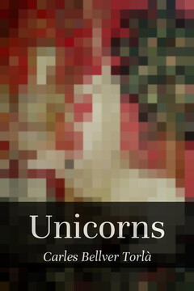
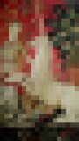
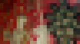

+++
license = "by-nc"
title = "Unicorns"
subtitle = "Improvisacions en 1.024 caràcters"
description = "Improvisacions en 1.024 caràcters."
image = "/contes/unicorns/cover_medium.jpg"
syndication = ["https://twitter.com/carlesbellver/status/1419047282067058689", "https://mastodon.social/@carlesbellver/109722908719576766"]
+++

<a href="unicorns_wallpaper_phone.jpg" class="tiny" style="color: var(--font-color);">Fons de pantalla telèfon</a>
<a href="unicorns_wallpaper_desktop.jpg" class="tiny" style="color: var(--font-color);">Fons de pantalla ordinador</a>

Seixanta-quatre exercicis d'estil: de la comèdia de costums a la fantasia oriental i l'horror còsmic o psicològic.

 [EPUB](/files/unicorns.epub)
 [PDF](/files/unicorns.pdf)

[Proemi](unicorns00)

  1. [Hi ha unicorns?](unicorns01)
  2. [*L’enfer, c’est les autres*](unicorns02)
  3. [La presència del mal](unicorns03)
  4. [Llegendes urbanes](unicorns04)
  5. [El cau de la bèstia](unicorns05)
  6. [A l’oficina de correus](unicorns06)
  7. [Notes per a la memòria final de la beca](unicorns07)
  8. [Un drac](unicorns08)
  9. [Jo era d’anís](unicorns09)
  10. [Eudoxia era rossa i es pentinava amb llargues trenes](unicorns10)
  11. [*Do you long for her, or for the way you were?*](unicorns11)
  12. [Manual d’instruccions](unicorns12)
  13. [*Logisch-Philosophische Abhandlung*](unicorns13)
  14. [*L’ultimo appello è da dimenticare*](unicorns14)
  15. [*Das Schnurren*](unicorns15)
  16. [El futur del món](unicorns16)
  17. [Dades sobre la localització de l’altiplà de Leng](unicorns17)
  18. [*Ghosting*](unicorns18)
  19. [Rue d’Auseil](unicorns19)
  20. [Records del Tibet](unicorns20)
  21. [Gramàtica teòrica](unicorns21)
  22. [El malson de debò és aquest](unicorns22)
  23. [Bibliografia](unicorns23)
  24. [Tornar a Paracels](unicorns24)
  25. [Contra els escèptics](unicorns25)
  26. [INS](unicorns26)
  27. [Les mars del sud](unicorns27)
  28. [*Et date illi honorem*](unicorns28)
  29. [Un ornitorrinc a l’armari](unicorns29)
  30. [Sòsia](unicorns30)
  31. [*Longer distance calling*](unicorns31)
  32. [*Reverse-charge call*](unicorns32)
  33. [Nomen sacrum](unicorns33)
  34. [Primer conte de fades](unicorns34)
  35. [Segon conte de fades](unicorns35)
  36. [Fins que la mort ens separi, xaval](unicorns36)
  37. [La història secreta del món](unicorns37)
  38. [Un farsant](unicorns38)
  39. [*Wishful thinking*](unicorns39)
  40. [Materials de construcció](unicorns40)
  41. [Segon Congrés de Futurologia](unicorns41)
  42. [Permuta](unicorns42)
  43. [El triangle](unicorns43)
  44. [*Le diable me suit de jour et de nuit car il a peur d’être seul*](unicorns44)
  45. [*Amour fou*](unicorns45)
  46. [Empori celestial](unicorns46)
  47. [La pell pintada](unicorns47)
  48. [Creuer pel Yann](unicorns48)
  49. [Arqueologia informàtica](unicorns49)
  50. [Teràpia](unicorns50)
  51. [*Bugs*](unicorns51)
  52. [Clark Nova](unicorns52)
  53. [Comptador de realitat](unicorns53)
  54. [Una mòmia és una mòmia](unicorns54)
  55. [*Die Grundlosigkeit*](unicorns55)
  56. [Com va guanyar Danvers una plaça a Miskatonic](unicorns56)
  57. [Viatge a Espanya](unicorns57)
  58. [*I remember Spain*](unicorns58)
  59. [Una eternitat](unicorns59)
  60. [Acció exterior](unicorns60)
  61. [Adéu-siau](unicorns61)
  62. [Darrera defensa](unicorns62)
  63. [*Je ne sais pas si vous vous souvenez de moi*](unicorns63)
  64. [Les ciutats perdudes](unicorns64)

[Coda](unicorns65)
