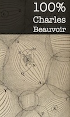

+++
title = "100 % Charles Beauvoir"
+++

Charles Beauvoir és un personatge proteïforme que apareix recurrentment en els meus llibres. L’any 2009 ja vaig utilitzar Twitter per publicar un dels seus relats, narrat en primera persona i en temps real al llarg d’un llarg dia: [24 hores Ch. B.](/taller/24horesChB/). Aquesta vegada, en canvi, l’experiència ha consistit a fer-li escriure històries autocontingudes, empaquetades cadascuna en els cent quaranta -o menys- caràcters d’un tuit. Van ser en total cent tuits, cent microcontes, més un extra de regal, difosos entre l’1 i el 21 de desembre de 2012. La inspiració em va venir de l’enigmàtic i fascinant [@AuthenticWmGibs](https://twitter.com/AuthenticWmGibs).

En aquest recull, alliberat de tan estrictes limitacions d’espai, he desfet algunes de les abreviatures més molestes, he arreglat la puntuació i he afegit uns quants enllaços, per qui vulgui saber més, o distreure’s una estona, però sense adulterar mai la concissió original.

També disponible en format ebook:

 [EPUB](100x100ChB.epub) [Kindle](100x100ChB.mobi)

[Carles Bellver Torlà](http://carlesbellver.net) 
Castelló de la Plana 
Desembre de 2012 - febrer de 2013

#### %001

La meva mili: tres mesos de servei civil com a renovador d’adhesions. Tenir la cartilla en regla era ineludible. Nosaltres facilitàvem el tràmit.

Dissabte [1 de desembre de 2012 08:47:35](http://twitter.com/chbeauvoir/status/274781776856100864)

#### %002

Divorcis en vacances. A l’aeroport, cridà al taxista. Allà, amb tantes maletes, no gosaven dir-li que mai no s’hi havia enlairat un avió.

Dissabte [1 de desembre de 2012 09:20:44](http://twitter.com/chbeauvoir/status/274790120786374656)

#### %003

[Fórmula Bensington &amp; Redwood](http://en.wikipedia.org/wiki/The_Food_of_the_Gods_and_How_It_Came_to_Earth) filtrada mercat bordurià. Alteracions físiques i malestar. Agents secrets britànics. S’hi entremet francès inepte.

Dissabte [1 de desembre de 2012 17:42:18](http://twitter.com/chbeauvoir/status/274916344695246848)

#### %004

Laboratori de robòtica. Una aranya mecànica. El mateix dia, diverses persones, en les seves cases, s’han sentit observades.

Dissabte [1 de desembre de 2012 19:43:16](http://twitter.com/chbeauvoir/status/274946784340623360)

#### %005

Una operació ritual, mil vegades més cruenta que la perforació del tercer ull. Però ningú no s’ha mort mai perquè li hagin arrencat el cor.

Dissabte [1 de desembre de 2012 21:50:45](http://twitter.com/chbeauvoir/status/274978869449224192)

#### %006

Li explica les virtuts terapèutiques de l’arsènic, avui sovint oblidades, i en acabat li’n proporciona un flascó. Dos colpets a l’esquena.

Diumenge [2 de desembre de 2012 08:36:14](http://twitter.com/chbeauvoir/status/275141308593631232)

#### %007

Rep un paquet postal remès pel seu marit mort. Un [fetitxe arumbaia](http://ca.wikipedia.org/wiki/L%27orella_escapçada), amb instruccions escrites per ell per a usar-lo per establir comunicació.

Diumenge [2 de desembre de 2012 08:45:40](http://twitter.com/chbeauvoir/status/275143683169456128)

#### %008

Un costum atàvic, tampoc no calia fer-se’n creus. Eren les festes patronals i les celebraven així, estovant el primer foraster que passava.

Diumenge [2 de desembre de 2012 18:04:30](http://twitter.com/chbeauvoir/status/275284316513243136)

#### %009

“Ja tenim la seva comanda.” Però ell no havia demanat res. Torna a casa amb la caixa. L’obre. Dins hi ha una pistola automàtica.

Diumenge [2 de desembre de 2012 20:13:23](http://twitter.com/chbeauvoir/status/275316750587920384)

#### %010

Kant es feia afaitar cada matí per l’ajudant del barber, un simi africà molt capaç amb la navalla i molt llegit i afeccionat a la metafísica.

Diumenge [2 de desembre de 2012 21:05:51](http://twitter.com/chbeauvoir/status/275329957226504192)

#### %011

Benet XVII declara dogmes de fe l’evolució de les espècies i la mecànica quàntica ([int. Copenhaguen](http://ca.wikipedia.org/wiki/Interpretació_de_Copenhaguen)). Bisbes dubten entre cisma i desdeny.

Dilluns [3 de desembre de 2012 07:04:45](http://twitter.com/chbeauvoir/status/275480674285264897)

#### %012

Contràriament a la llegenda, les bombes instal·lades sota molts edificis de Szohôd per ordre del govern no eren nuclears, sinó convencionals.

Dilluns [3 de desembre de 2012 16:32:21](http://twitter.com/chbeauvoir/status/275623514738921472)

#### %013

Et devoraré i et rosegaré els ossos, l’amenaça el bou. Ets herbívor, es defèn. La teva carn em fa fàstic, però et menjaré perquè t’odio.

Dilluns [3 de desembre de 2012 17:50:31](http://twitter.com/chbeauvoir/status/275643187555606529)

#### %014

Adeptes secta porten sempre una caixa sota el braç. Pèrdua d’una sumeix ciutat en el caos. La troba un infant, l’obre. Llavors eclipsi. Fi.

Dilluns [3 de desembre de 2012 22:36:33](http://twitter.com/chbeauvoir/status/275715167059329024)

#### %015

Àngels li manen fer coses terribles. Cava túnel, acumula dinamita sota Museu Britànic. Scotland Yard espera, informats de tràfic d’explosius.

Dilluns [3 de desembre de 2012 22:45:58](http://twitter.com/chbeauvoir/status/275717540775333889)

#### %016

Estesa de cefalòpods gegants, espècie inconeguda, costa noruega 1882. Repetició cíclica del fenomen, correlació amb tempestes geomagnètiques.

Dimarts [4 de desembre de 2012 07:01:10](http://twitter.com/chbeauvoir/status/275842160388087809)

#### %017

[Poeta francès](http://www.theparisreview.org/interviews/4388/the-art-of-fiction-no-38-blaise-cendrars) escriu una obra mestra i la diposita en un banc del Brasil perquè la descobreixi la posteritat. Agents de la CIA la sostreuen.

Dimarts [4 de desembre de 2012 15:46:12](http://twitter.com/chbeauvoir/status/275974289562419200)

#### %018

A. B. Danvers fastiguejat Espanya franquista després que no reeixí a adquirir crani d’un ciclop pel preu excessiu exigit pel propietari.

Dimarts [4 de desembre de 2012 19:24:59](http://twitter.com/chbeauvoir/status/276029347029209090)

#### %019

Població marciana aborigen delmada per [E. Coli](http://ca.wikipedia.org/wiki/Escherichia_coli). Mercat negre d’estreptomicina. Lluita entre faccions. [Westonburg](http://en.wikipedia.org/wiki/Professor_Weston) alliberada.

Dimarts [4 de desembre de 2012 22:06:35](http://twitter.com/chbeauvoir/status/276070014149328897)

#### %020

Abaixe la persiana, em fa vergonya que em veges nua. Ell, es resignava al seu cos. El d’ella li semblava perfecte, o delitosament imperfecte.

Dimarts [4 de desembre de 2012 23:04:54](http://twitter.com/chbeauvoir/status/276084691176681472)

#### %021

Fins que la mort ens separi, xaval, l’acomiadà el comissari en l’estació. El sobre contenia les esqueles de tots els que havia delatat.

Dimecres [5 de desembre de 2012 07:02:23](http://twitter.com/chbeauvoir/status/276204853427073024)

#### %022

M’ha reconegut i ens hem ruboritzat alhora. Era obvi que ella també havia somiat desperta i fantasiejat amb mi últimament.

Dimecres [5 de desembre de 2012 17:51:38](http://twitter.com/chbeauvoir/status/276368241566314496)

#### %023

Sóc el teu àngel bo, li diu. Li demana que no torni, però no el tira per l’escala, ha obert la porta i han forcejat, ha estat un accident.

Dimecres [5 de desembre de 2012 21:35:43](http://twitter.com/chbeauvoir/status/276424634239442945)

#### %024

Dictador en fuita. Maleta curulla d’ossos de les seves víctimes. El maten al carreró rebels barbuts. I a aquests, agents amb corbata.

Dimecres [5 de desembre de 2012 22:37:32](http://twitter.com/chbeauvoir/status/276440193077223424)

#### %025

25 kg. cucs en llaunes. Vius. Potser tòxics, anàlisis pendents. Destinació restaurants xinesos, ritus exòtics o enverinaments massius?

Dimecres [5 de desembre de 2012 22:49:23](http://twitter.com/chbeauvoir/status/276443172958248961)

#### %026

Danvers fou invitat a llegir el Necronomicon en obtenir el doctorat cum laude en la [MU](http://en.wikipedia.org/wiki/Miskatonic_University). Passà la nit udolant i al matí signà contracte.

Dijous [6 de desembre de 2012 08:34:10](http://twitter.com/chbeauvoir/status/276590341405151232)

#### %027

Nova autoritat reguladora UE inicia la desinfecció i desinfestació d’oficines bancàries simultàniament a Alemanya i països del sud.

Dijous [6 de desembre de 2012 08:38:39](http://twitter.com/chbeauvoir/status/276591466837590016)

#### %028

Escletxes, humitats. Aigua de l’aixeta tèrbola, no renta. La ràdio parla d’un deteriorament general de la realitat, demana prudència.

Dijous [6 de desembre de 2012 08:42:31](http://twitter.com/chbeauvoir/status/276592442675965952)

#### %029

Dos mesos en un soterrani de la [DGS](http://es.wikipedia.org/wiki/Dirección_General_de_Seguridad). Colps, alcohol, aberracions sexuals. El fiquen en un tren, s’adorm i va a parar a una altra ciutat.

Dijous [6 de desembre de 2012 22:47:53](http://twitter.com/chbeauvoir/status/276805183642681344)

#### %030

Museu d’Onda, taller del taxidermista. Cadàver recent d’un diable de Tasmània: Diabolus Ursinus. Però a mi em pareixia un homuncle.

Dijous [6 de desembre de 2012 22:54:45](http://twitter.com/chbeauvoir/status/276806914124419072)

#### %031

4 juliol 1958 8AM, FBI clausura la Miskatonic University. 7AM Professor del Departament de Geologia observa que li creixen tentacles al cap.

Divendres [7 de desembre de 2012 07:01:16](http://twitter.com/chbeauvoir/status/276929349242990593)

#### %032

[Lord Dunsany](http://en.wikipedia.org/wiki/Edward_Plunkett,_18th_Baron_of_Dunsany) a Morella en la primera guerra carlista? Ho va somniar. Cercava la medalla de Cabrera que li donà una garsa i no la trobava.

Divendres [7 de desembre de 2012 07:04:56](http://twitter.com/chbeauvoir/status/276930270479917056)

#### %033

Per més que ho intenta no reïx mai a triar el camí errat en la cruïlla d’Aylesbury després de Dean’s Corners per arribar a [Dunwich](http://en.wikisource.org/wiki/The_Dunwich_Horror/Chapter_I).

Divendres [7 de desembre de 2012 15:22:46](http://twitter.com/chbeauvoir/status/277055555284111361)

#### %034

Les vendes d’unitats domèstiques d’electroxoc augmentaren notablement durant el bienni 2014-15, anys després de l’autorització de la [FDA](http://en.wikipedia.org/wiki/Electroshock#Degree_of_effectiveness_and_risks).

Divendres [7 de desembre de 2012 19:55:10](http://twitter.com/chbeauvoir/status/277124106678304768)

#### %035

[Faune descobrint una dona](http://www.fundacionico.es/index.php?id=156); estampeta de Sant Josep Mengele. Perversió de l’Església: dinàmica interna o obra d’ateus infiltrats?

Divendres [7 de desembre de 2012 19:57:23](http://twitter.com/chbeauvoir/status/277124665225396224)

#### %036

El que compta és la grandesa de l’esperit. Però el seu era menut -li passava entre les cames- i malvat. I sobretot molt malparlat.

Dissabte [8 de desembre de 2012 10:53:50](http://twitter.com/chbeauvoir/status/277350264745365504)

#### %037

Abans d’aterrar sobrevolem bocabadats els canals de [Schiaparelli](http://en.wikipedia.org/wiki/Giovanni_Schiaparelli). La guia és baixeta, bruna-oliva, té la peculiar dicció marciana.

Dissabte [8 de desembre de 2012 12:22:09](http://twitter.com/chbeauvoir/status/277372488802000897)

#### %038

Els carrers cremaven, la calçada amb resplendor blavosa, les voreres amb foc roig viu. Per a eixir em posaria calcer de sola gruixuda.

Dissabte [8 de desembre de 2012 22:10:26](http://twitter.com/chbeauvoir/status/277520535330623488)

#### %039

Cultiu de fongs microscòpics trobats en una roca lunar. Al·lucinògens, escala [Hofmann](http://ca.wikipedia.org/wiki/Albert_Hofmann) triplica LSD. Onada de suïcidis en el [KSC](http://ca.wikipedia.org/wiki/Centre_espacial_John_F._Kennedy).

Dissabte [8 de desembre de 2012 22:31:04](http://twitter.com/chbeauvoir/status/277525728076132352)

#### %040

Cada vegada que Iuri Gagarin superava els 2 g/l alcohol en sang afloraven records del viatge teòricament suprimits en l’Institut Pavlov.

Dissabte [8 de desembre de 2012 22:32:49](http://twitter.com/chbeauvoir/status/277526170642292736)

#### %041

Folklore mites de Cthulhu s’apropa perillosament a abisme de desil·lusió en el [cicle de sobreexpectació](http://en.wikipedia.org/wiki/Hype_cycle) de Gartner. Reunió secreta Pentàgon.

Diumenge [9 de desembre de 2012 10:08:01](http://twitter.com/chbeauvoir/status/277701122116947968)

#### %042

Gasolinera abandonada carretera d’Alcora convertida per extremistes templers en dipòsit clandestí 17 kl àcid bòric, dia D més prop.

Diumenge [9 de desembre de 2012 16:12:44](http://twitter.com/chbeauvoir/status/277792907241611266)

#### %043

Gavina morta en eixir de la feina. O era un corb? Ara bufa una mica d’aire des de qui sap on. Benvinguda sigui, em dic, aquesta salabror.

Diumenge [9 de desembre de 2012 17:24:42](http://twitter.com/chbeauvoir/status/277811017986240512)

#### %044

F. Gehry construeix búnquer en els fonaments del rectorat de la [VIU](http://www.levante-emv.com/comunitat-valenciana/2011/03/12/viu-abre-sede-provisional-espera-gehry/789834.html). Després d’enllestir-lo, l’obra s’atura per caiguda de pressupost.

Diumenge [9 de desembre de 2012 17:26:36](http://twitter.com/chbeauvoir/status/277811494689857536)

#### %045

Conta [Conrad](http://en.wikipedia.org/wiki/Joseph_conrad) que un nàufrag negre és l’únic a bord que sap desfer-se d’un horlà. Una segona vegada, a port, l’horlà el mata.

Diumenge [9 de desembre de 2012 17:27:04](http://twitter.com/chbeauvoir/status/277811612465909760)

#### %046

[HPL](http://en.wikipedia.org/wiki/H._P._Lovecraft) no mor 15 març 1937, se salva miraculosament i viu una segona vida secreta, en parella amb infermera. Escriu almanacs científics.

Dilluns [10 de desembre de 2012 06:59:24](http://twitter.com/chbeauvoir/status/278016042062725121)

#### %047

Dr. Jekyll escriu biografia del Sr. Hyde, el qual reclama judicialment que se’n canviï el títol per “Oda al [Corpus Callosum](http://en.wikipedia.org/wiki/Corpus_callosum)”.

Dilluns [10 de desembre de 2012 18:19:07](http://twitter.com/chbeauvoir/status/278187100048855040)

#### %048

“Es lloga pis. Criat malgaix inclòs.” L’adreça era la meva. Bru, mala sort, devia tres mesos. Vaig fugir.

Dilluns [10 de desembre de 2012 18:40:28](http://twitter.com/chbeauvoir/status/278192472931303424)

#### %049

Xiquet ingúix capta emissió extraterrestre 25m anys llum amb ràdio àvia, sintonitza cada nit i aprèn idioma, estranyament semblant al seu.

Dilluns [10 de desembre de 2012 19:55:16](http://twitter.com/chbeauvoir/status/278211296510504961)

#### %050

Periodista La Vanguardia troba [Ivan Istòixnikov](http://www.microsiervos.com/archivo/leyendas-urbanas/ivan-istochnikov.html) i gos Kloka en una masia de l’Empordà. No recorda res de Soyuz 2. Desapareixen.

Dilluns [10 de desembre de 2012 19:58:33](http://twitter.com/chbeauvoir/status/278212120552808448)

#### %051

Lestrígons i ciclops, m’advertí, Posidó no trobaràs, si no els portes dins de tu. Doncs millor, vaig pensar, que no emprengui el viatge.

Dimarts [11 de desembre de 2012 07:29:44](http://twitter.com/chbeauvoir/status/278386062127144960)

#### %052

Els híbrids humà-ximpanzè criats per I. I. Ivanov a Guinea-Conakry rendien força bé en les plantacions de tabac i en les mines de bauxita

Dimarts [11 de desembre de 2012 16:34:35](http://twitter.com/chbeauvoir/status/278523178198921217)

#### %053

Dupin va trobar Brown Jenkin en la rue d’Auseil, però s’esfumà de nou, fins la Semaine sanglante. 1848 i 1871. Deportat a Nova Caledònia.

Dimarts [11 de desembre de 2012 19:02:39](http://twitter.com/chbeauvoir/status/278560443361017856)

#### %054

Quan va començar a tenir lapsus de memòria va contractar un detectiu perquè el seguís i l’informés. Dama enigmàtica. Píndoles. Engranatges.

Dimarts [11 de desembre de 2012 19:22:47](http://twitter.com/chbeauvoir/status/278565510956855296)

#### %055

Enviaments postals amb mosques tse-tse en distints punts del país. CIA segueix rastre fins República de Leng. Embargament. Setge. Horror.

Dimarts [11 de desembre de 2012 20:37:11](http://twitter.com/chbeauvoir/status/278584234430562304)

#### %056

Capítol local de la Societat Teosòfica. Seraphim Karelly entre nosaltres. Demostració de levitació, histèria col·lèctiva, colps, espentes.

Dimecres [12 de desembre de 2012 06:57:43](http://twitter.com/chbeauvoir/status/278740394362159104)

#### %057

Ràdio Vaticana entrevista [C. S. Lewis](http://en.wikipedia.org/wiki/C._S._Lewis), nunci de Sa Santedat en l’Espai Exterior. Emissió es talla, expedició de rescat. Satèl·lit assolat.

Dimecres [12 de desembre de 2012 19:58:52](http://twitter.com/chbeauvoir/status/278936977699663872)

#### %058

Es desperta en llit estrany i dubta que pugui tornar a casa: la ciutat canvia constantment i no hi ha plànols vàlids. Resignat a restar-hi.

Dimecres [12 de desembre de 2012 20:10:17](http://twitter.com/chbeauvoir/status/278939852005859329)

#### %059

Un mag mai explica els trucs, li digué. El féu desaparèixer, i quan aconseguí tornar a casa l’hi trobà casat amb la seva dona, i amb fills.

Dimecres [12 de desembre de 2012 21:38:34](http://twitter.com/chbeauvoir/status/278962067036327938)

#### %060

Que et bellugui una dent en un somni vol dir que tens por d’envellir o de fracassar, li diu el dentista. Li mossega un turmell.

Dimecres [12 de desembre de 2012 22:26:43](http://twitter.com/chbeauvoir/status/278974184334434304)

#### %061

[Mancúspia](http://es.wikipedia.org/wiki/Mancuspia): ecològicament innòcua, però criança massiva en granges augmenta símptomes difusos en la població propera: cefalees, urticàries.

Dijous [13 de desembre de 2012 07:02:52](http://twitter.com/chbeauvoir/status/279104078733275136)

#### %062

Pregunta en una llibreria i descobreix amb estupor que no s’imprimeixen ja mapes, perquè no cal que ningú vagi enlloc.

Dijous [13 de desembre de 2012 07:28:32](http://twitter.com/chbeauvoir/status/279110538926108672)

#### %063

L’acusació era exagerada, els McCoy no devoraven els bebès: els raptaven per dur-los a l’orfenat i que els adoptessin famílies catòliques.

Dijous [13 de desembre de 2012 14:12:44](http://twitter.com/chbeauvoir/status/279212257890684928)

#### %064

Bon esperit Xin de les prades i els boscos de bambú a la vora del Mekong, tant de bo que restis sempre amb mi, gola avall.

Dijous [13 de desembre de 2012 19:45:47](http://twitter.com/chbeauvoir/status/279296071405010944)

#### %065

El menú, frugal però exquisit: sopa d’ossos de cavall i saltat d’alfals amb llagosts. Després, esperant el cafè, vam calar foc als havans.

Dijous [13 de desembre de 2012 22:51:26](http://twitter.com/chbeauvoir/status/279342795230179328)

#### %066

Naufragi 1921 davant de Sulaco, vaixell emergeix espontàniament 1996. Recerques, recuperen objectes. De nou s’enfonsa. Misteri inexplicat.

Divendres [14 de desembre de 2012 07:00:58](http://twitter.com/chbeauvoir/status/279465988162998274)

#### %067

Biblioteca Strahov: Necronomicon entre <em>Dissertació sobre el sexe de les plantes</em> de Linné i <em>Assaig sobre visions de fantasmes</em> de Schopenhauer.

Divendres [14 de desembre de 2012 07:02:22](http://twitter.com/chbeauvoir/status/279466339863756801)

#### %068

Cerquen quelcom valuós en el subsòl d’una comarca muntanyosa. Al nord de Castelló? El porc negre que els acompanya, un animal diabòlic.

Divendres [14 de desembre de 2012 15:36:33](http://twitter.com/chbeauvoir/status/279595739276005378)

#### %069

Un home de mitjana edat, sent nostàlgia de l’infinit després de contemplar el famós [quadre](http://en.wikipedia.org/wiki/The_Nostalgia_of_the_Infinite) de De Chirico. Una còpia, de fet. Es deprimeix.

Divendres [14 de desembre de 2012 18:15:11](http://twitter.com/chbeauvoir/status/279635661420638208)

#### %070

Una ampolla 15 cc d’elixir de l’oblit (Non Remember Fluid) robada a l’Institut Pavlov costa 20.000 RUB mercat negre Sant Petersburg.

Divendres [14 de desembre de 2012 20:00:45](http://twitter.com/chbeauvoir/status/279662226955198464)

#### %071

Núvia per correu. Dins d’una caixa, des de Corea. Cara agradable, però anatomia inusual. Veu metàl·lica causa mal de cap. No retornable.

Dissabte [15 de desembre de 2012 08:53:13](http://twitter.com/chbeauvoir/status/279856623856517120)

#### %072

Em rendisc. Accepte, a condició que em feu passar pel mort i em doneu una plaça en l’estranger.

Dissabte [15 de desembre de 2012 09:20:35](http://twitter.com/chbeauvoir/status/279863513286049792)

#### %073

[Oppenheimer](http://en.wikipedia.org/wiki/J._Robert_Oppenheimer) desitja secretament que Teller tingui raó, esdevenir Xiva, destruir el món per una reacció en cadena en el primer assaig atòmic.

Dissabte [15 de desembre de 2012 11:35:33](http://twitter.com/chbeauvoir/status/279897478294286336)

#### %074

Xarxa de botigues de compra d’or, vinculada a experiments financers de govern regional. Mafiosos apallissen vicepresident segon.

Dissabte [15 de desembre de 2012 15:32:48](http://twitter.com/chbeauvoir/status/279957185071566849)

#### %075

Malauradament per a ell, la [hiperòsmia](http://en.wikipedia.org/wiki/Hyperosmia) induïda per les anfetamines cedí aviat i degenerà en una clara osmàlgia.

Diumenge [16 de desembre de 2012 00:06:52](http://twitter.com/chbeauvoir/status/280086551155851265)

#### %076

Lord Oxmore no va ser rescatat al Serengeti. Els trets dels caçadors el van matar i el va suplantar un lleó al qual havia ensenyat a parlar.

Diumenge [16 de desembre de 2012 11:54:04](http://twitter.com/chbeauvoir/status/280264523183710209)

#### %077

Tu i jo ens trobàvem sempre en palauets romàntics, davant d’estanys en tardors de somnis vagues. Te m’apropaves de gairell inadvertida.

Diumenge [16 de desembre de 2012 12:55:19](http://twitter.com/chbeauvoir/status/280279940346306560)

#### %078

Agressió salvatge en una partida de pòquer. Dos dels participants n’acusen un 3r. El 4t declara la irrupció d’un 5è d’aparença bestial.

Diumenge [16 de desembre de 2012 20:01:34](http://twitter.com/chbeauvoir/status/280387209587220480)

#### %079

Descobreixen antigues mines d’indis algonquins a Vermont. Gent amb caretes estranyes als pobles del voltant. Se senten veus als boscos.

Diumenge [16 de desembre de 2012 20:02:38](http://twitter.com/chbeauvoir/status/280387476709851136)

#### %080

Em desperten els trucs i la pesanta que s’esmunyeix sota el llit, com sempre que es materialitzen els malsons que em provoca.

Diumenge [16 de desembre de 2012 23:16:31](http://twitter.com/chbeauvoir/status/280436267848720384)

#### %081

Trobada casual amb [R. L. Stevenson](http://en.wikipedia.org/wiki/Robert_Louis_Stevenson) en una carnisseria de Samoa, evita que compri carn humana. Nadius caníbals en diuen “porc llarg”.

Dilluns [17 de desembre de 2012 07:01:55](http://twitter.com/chbeauvoir/status/280553391913046016)

#### %082

[Dr. Ransom](http://en.wikipedia.org/wiki/Elwin_Ransom), advocat del “solar antic”, reconeix q és una invenció, “com l’esperanto”. Esperantistes destaquen diferències, se’n desvinculen.

Dilluns [17 de desembre de 2012 16:36:32](http://twitter.com/chbeauvoir/status/280697996428050434)

#### %083

Plagues, Carib delmat. Rebels de Costaguana ocupen terres, base de llançament europea. Primera potència espacial sense estat.

Dilluns [17 de desembre de 2012 16:36:53](http://twitter.com/chbeauvoir/status/280698085494124544)

#### %084

Li ofereixen una caixa de fusta, li diuen que conté l’ànima perduda del seu avi. Per esnobisme, per curiositat, per avorriment, la compra.

Dilluns [17 de desembre de 2012 19:17:27](http://twitter.com/chbeauvoir/status/280738493142020096)

#### %085

Nou intent francès d’assaig atòmic, prop d’on s’han trobat indicis arqueològics de [R’lyeh](http://en.wikipedia.org/wiki/R'lyeh), just abans de conjunció estel·lar, terratrèmol.

Dilluns [17 de desembre de 2012 19:18:05](http://twitter.com/chbeauvoir/status/280738652768854016)

#### %086

Macacos escriuen fragment Shakespeare amb PCW 8256, però d’obra apòcrifa (<em>Locrine</em>). 25 anys, laboratori cancel·la projecte, sacrifica [micos](http://en.wikipedia.org/wiki/Infinite_monkey_theorem).

Dimarts [18 de desembre de 2012 07:02:24](http://twitter.com/chbeauvoir/status/280915899085635585)

#### %087

Renill monstruós i per dalt del campanar plana un drac o un shantak: l’ocellot cavallí, espantós i cruel, descrit en llegendes sumèries.

Dimarts [18 de desembre de 2012 16:08:16](http://twitter.com/chbeauvoir/status/281053271056076800)

#### %088

Científics NASA incapaços d’explicar falses “ruïnes” i anomalies marcianes, tenen malsons, lamenten haver llegit <em>Solaris</em>, maleixen [S. Lem](http://en.wikipedia.org/wiki/Stanislaw_Lem).

Dimarts [18 de desembre de 2012 17:23:56](http://twitter.com/chbeauvoir/status/281072313183645696)

#### %089

Milionari compra única còpia de [Llibre de Soyga](http://en.wikipedia.org/wiki/Book_of_Soyga) en Sotheby’s, l’oblida en tauleta del saló amb National Geographic i Sports Illustrated.

Dimarts [18 de desembre de 2012 17:26:37](http://twitter.com/chbeauvoir/status/281072991050293248)

#### %090

Milionari malalt d’avorriment inspirat en llibre d’[O. Sacks](http://en.wikipedia.org/wiki/Oliver_Sacks) es fa practicar una lobectomia temporal bilateral i deixa de reconèixer sa mare.

Dimarts [18 de desembre de 2012 23:04:42](http://twitter.com/chbeauvoir/status/281158070426558464)

#### %091

Obre per error un sobre adreçat al seu veí, una mena d’informe sobre tortures que l’horroritza. No gosa conservar-lo, ni desfer-se’n.

Dimecres [19 de desembre de 2012 06:58:28](http://twitter.com/chbeauvoir/status/281277297250680832)

#### %092

La tortuga és un animal infernal. En compren una partida per poblar un estany i es fiquen pertot, la casa, el cotxe. Provoquen un accident.

Dimecres [19 de desembre de 2012 16:26:14](http://twitter.com/chbeauvoir/status/281420183258669056)

#### %093

Una altra guerra secreta -contra la triada Tian Di Hui- va ocasionar la migració de [Tristero](http://en.wikipedia.org/wiki/Tristero) a les xarxes digitals encriptades, cap a 1999.

Dimecres [19 de desembre de 2012 18:29:45](http://twitter.com/chbeauvoir/status/281451265203007488)

#### %094

Obres, volen fer passar tots els túnels per refugis de la darrera guerra civil, però criden l’atenció certs baixos relleus i inscripcions.

Dimecres [19 de desembre de 2012 18:57:04](http://twitter.com/chbeauvoir/status/281458141827317761)

#### %095

Úrsula enroscava el coll per besar tendrament [Borís [Vian]](http://en.wikipedia.org/wiki/Boris_Vian) en la nuca i ell li prometia que un dia marxarien a Àfrica tots dos junts

Dimecres [19 de desembre de 2012 19:18:24](http://twitter.com/chbeauvoir/status/281463508141481984)

#### %096

Després de dedicar sa vida a desxifrar-lo, el contingut del [manuscrit Voynich](http://en.wikipedia.org/wiki/Voynich_manuscript) li sembla banal. Coi de sexualitat hipertrofiada.

Dijous [20 de desembre de 2012 07:01:22](http://twitter.com/chbeauvoir/status/281640416607100928)

#### %097

Matrimoni mixt. Lluna de mel en Westonburg. Turisme marcià. Ruïnes circulars. Somnis reminiscents. Una sospita.

Dijous [20 de desembre de 2012 15:08:20](http://twitter.com/chbeauvoir/status/281762964602757120)

#### %098

Xin: delicatessen mística, fong gegant, s’escampa pel subsol i aflora en forma de cucs o bolets individuals, narcòtics, cal engolir sencers.

Dijous [20 de desembre de 2012 16:02:56](http://twitter.com/chbeauvoir/status/281776705566298112)

#### %099

El drac i el tigre en l’escut d’un mas. A desgrat dels llibres d’història, aquest país va ser governat antigament per invasors xinesos.

Dijous [20 de desembre de 2012 19:16:33](http://twitter.com/chbeauvoir/status/281825430049288192)

#### %100

Guanya en un sorteig un creuer per a dues persones pel Yann. Encoratjat per la sort, proposa a una desconeguda en un bar que l’hi acompanyi.

Dijous [20 de desembre de 2012 20:58:06](http://twitter.com/chbeauvoir/status/281850985285042177)

#### Epíleg

Troben erroni el còmput del [calendari maia](http://ca.wikipedia.org/wiki/Calendari_maia). La fi del món s’esdevingué dècades enrere. Des de llavors vivim en un no-futur postapocalíptic.

Divendres [21 de desembre de 2012 06:33:34](http://twitter.com/chbeauvoir/status/281995809988431872)

#### __END__
