+++
title = "Escriure —breument— en temps d'Internet"
description = "Conferència en el Taller d’escriptura creativa de l’UJI. Castelló de la Plana, Llotja del Cànem, 17 de gener de 2017."
image = "slide.001.jpg"
+++

Conferència en el Taller d’escriptura creativa de l’UJI. Castelló de la Plana, Llotja del Cànem, 17 de gener de 2017.

## (1)

<a href="slide.001.jpg">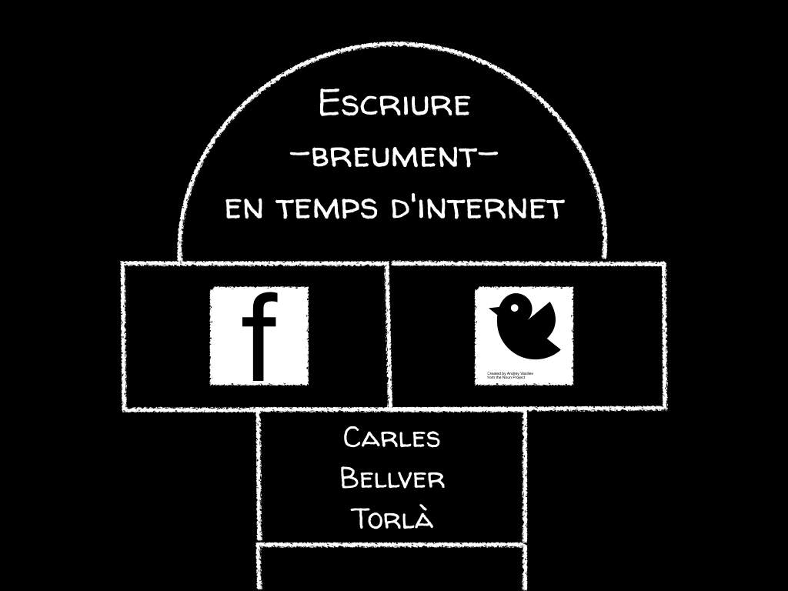</a>

Bona vesprada. Salutacions a totes i a tots i gràcies, en primer lloc, a Pasqual Mas i a Rosario Raro per convidar-me a estar ací amb vosaltres, participant en aquest taller d’escriptura creativa de l’UJI que dirigeixen. Amb una xerrada, una conferència, que hem titulat “Escriure —breument— en temps d’Internet”.

## (2)

Pasqual ja m’ha presentat com a autor d’una sèrie de llibres. Per això se suposa que sóc ací. Parlaré una mica dels meus llibres, però també parlaré d’altres coses. Són tots llibres de contes, reculls de relats entre breus i molt breus. N’hi ha alguns d’una pàgina, de dues, tres, o quatre pàgines, alguns de quinze o vint pàgines. El més llarg té quaranta i tantes pàgines i és una excepció. És el que dóna títol al meu últim llibre, “Un cel nou i una terra nova”, premi Pascual Tirado de 2015, que és probablement el que coneixeu. També són tots, o la gran majoria, contes fantàstics. Molt rarament algun conte meu no inclou elements fantàstics i aleshores jo mateix em sorprenc. Però ni una cosa ni l’altra, ni la brevetat ni els elements fantàstics, són decisions prèvies. És com ha resultat, a posteriori, que m’agrada escriure.

## (3)

D’altra banda, per a completar la presentació, també s’ha mencionat que sóc analista de tecnologia educativa en la Universitat Jaume I. Tots els escriptors ens hem de guanyar la vida d’alguna manera i molts ens la guanyem amb oficis que no tenen res a veure, en principi, amb la literatura. Vaig començar a treballar en l’UJI l’any 1992, durant el primer curs acadèmic de la Universitat de Castelló, i la meua feina en aquell moment era com a programador d’aplicacions. Feia coses tan prosaiques com programar les pantalles d’introducció de dades de matrícula o de les dades econòmiques del personal, etc. Però també van ser aquells els anys en què va començar a difondre’s la Internet i vaig tenir la sort d’estar allí, en l’equip que va posar en marxa el primer servidor web d’Espanya cap al setembre de 1993. Era, evidentment un web molt més rudimentari que els que coneixem ara. Permetia consultar el directori de telèfons i adreces del personal de l’UJI, el catàleg de la Biblioteca, i contenia molt poca informació més. Per omplir-lo una mica, i per aprendre a gestionar el format HTML, vam utilitzar com a material els arxius d’un fanzine literari en què jo estava implicat amb dos amics meus. Una revisteta que es titulava [Contes per a extraterrestres](https://carlesbellver.net/CPE) i que es va convertir així en la primera publicació literària d’Internet en català i la primera d’Espanya.

## (4)

<a href="slide.004.jpg">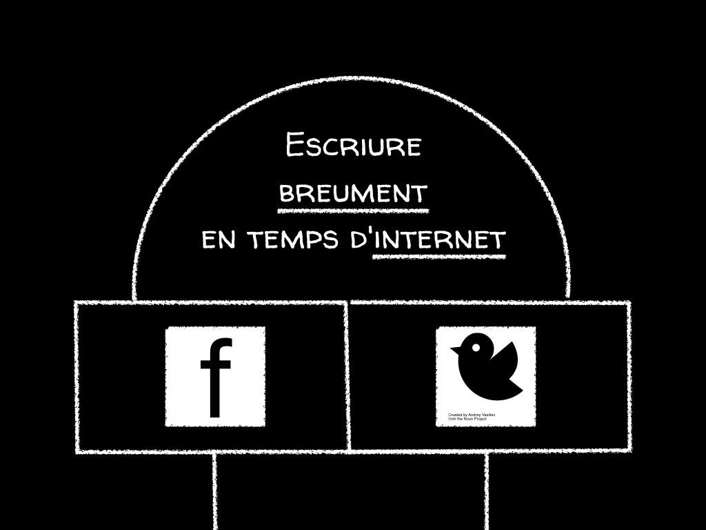</a>

De manera que ja veiem que aquesta dualitat meva d’escriptor amateur i professional de les noves tecnologies no es resol en realitat en dos aspectes sempre i totalment desconnectats. I això em permet explicar el títol de la xerrada: “Escriure breument” —perquè és com m’agrada escriure— “en temps d’Internet”, perquè és en aquest temps i en aquest ambient que m’ha tocat casualment escriure. Ja he dit que treballe en temes d’Internet des de 1992 o 1993 i va ser també el 1993 quan es va publicar el primer dels meus llibres. El que pretenc explicar-vos en aquesta conferència és com m’he divertit aquests més de vint anys, quasi vint-i-cinc, escrivint relats breus i fent servir Internet. Més exactament, com m’he *divertit* en la confluència d’aquests dos àmbits, perquè ha estat per a mi una experiència apassionant. Subratlle divertit perquè és una paraula clau. L’aspecte lúdic de la qüestió serà un tema recurrent. Per a mi la literatura és un joc. No ho dic com a reflexió teòrica sinó com a constatació pràctica.

## (5)

Una digressió. Potser a hores d’ara ja no sorprendrà a ningú que es parle d’escriptura i de literatura en el context d’Internet. En el context dels blogs, de les xarxes socials, etc. Però m’agradaria matisar que això no era així fa quinze o més anys, quan Internet era una novetat. Cal dir que la gent que es dedica a escriure no són —no som— sempre dels primers a abraçar les novetats. El 23 d’abril —el dia de Sant Jordi— de l’any 2000, el diari Avui va dedicar un suplement especial al fenòmen d’Internet. Com a part d’aquell especial, es va demanar a quaranta o més escriptors i escriptores que expressessin la seva opinió sobre Internet amb relació a la literatura. N’hi havia de tot, evidentment. Escriptors i escriptores no som cap raça especial. Però algunes opinions xocaven, més que per ser contràries a Internet, per no voler saber res de la xarxa. Conserve aquell exemplar en versió digital, perquè en aquell moment l’Avui distribuïa gratuïtament en el web la versió PDF del diari, així que us en puc mostrar alguns retalls. El xoc era tal que, la setmana següent, Màrius Serra, molt més *open minded* que la mitjana dels seus col·legues, els adreçava un article bastant sarcàstic en les pàgines del mateix diari. El titulava “Bartlebys d’Internet”, per aquell personatge de Herman Melville, un oficinista indolent i enigmàtic que davant de qualsevol ordre que li donaven contestava *“I would prefer not to”*: preferiria no fer-ho.

## (6)

<a href="https://commons.wikimedia.org/wiki/File:A_common_case_of_%22team_work.%22_Smaller_boy,_Joseph_Bishop,_goes_into_saloons_and_sells_his_last_paper._Then_comes_out..._-_NARA_-_523168.jpg">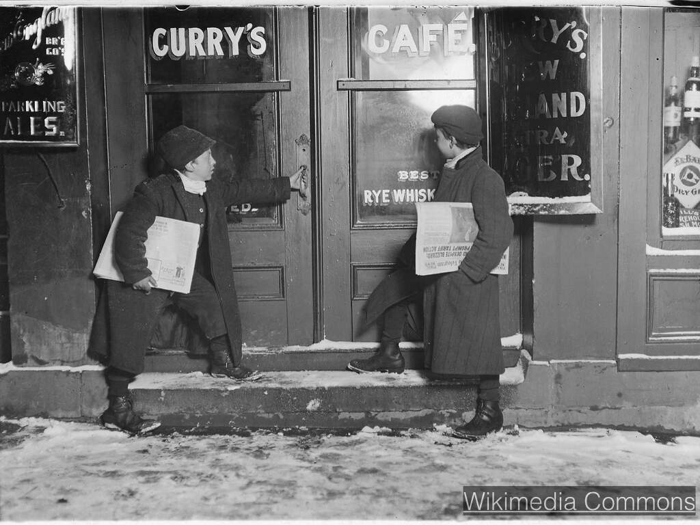</a>

Aclarirem que molts altres dels que havien opinat no s’oposaven tan rotundament a Internet. Fins i tot reconeixien en la xarxa algunes virtuts. Sobretot com a recurs on anar a buscar informació, on documentar-se per a les seves novel·les, per a les seves creacions literàries. Com a biblioteca de Babel on podies trobar-ho tot. I pel que feia al correu electrònic, alguns destacaven el reviscolament del costum d’escriure’s, de l’intercanvi epistolar. Ningú o quasi ningú, tanmateix, parlava del potencial d’Internet com a impremta personal, com a manera d’autopublicar-se. Ni tampoc de la facilitat per a establir contacte entre l’autor i els seus lectors. Supose que, simplement, aquestes necessitats ja les tenien resoltes, atès que es tractava d’escriptors consagrats i que, a més a més, majoritàriament, treballaven en mitjans de comunicació com a periodistes, articulistes, etc. Ja publicaven les seves obres per les vies editorials convencionals i ja tenien contacte amb el seu públic a través de les pàgines dels diaris, la ràdio, conferències, etc.

## (7)

<a href="slide.007.jpg">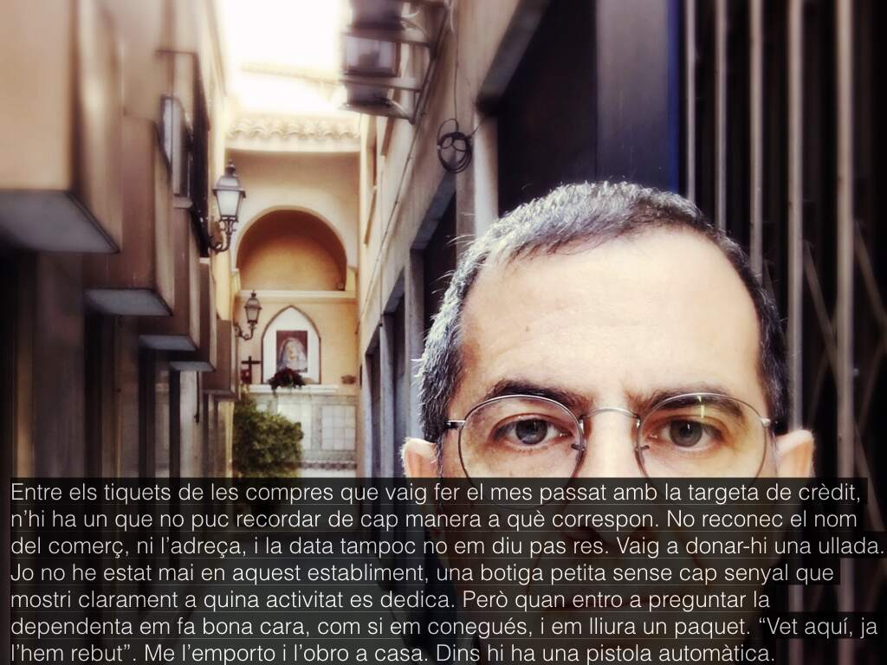</a>

Cinc anys després, al 2005, vaig participar en unes [jornades sobre dietarisme i blogs](https://carlesbellver.net/2005/06/08/impressions-de-sant.html) organitzades per VilaWeb i la Institució de les Lletres Catalanes. El fet que s’organitzessin aquestes jornades, amb autors de blogs i autors de llibres, junts, indicava que la situació ja estava canviant. Però vaig poder comprovar que algunes actituds encara es mantenien. Recorde que allí, en el monestir de Sant Cugat, Vicenç Villatoro va dir que potser s’obriria un blog quan el fessin fora de l’Avui. No sé si va complir l’amenaça. No em consta. Però això, escriure un blog, era el que en aquell moment estàvem fent molt gent sense tant de nom com ell. No com a substitut d’una altra cosa millor, sinó perquè poder escriure i ser llegit immediatament, i rebre comentaris de qui t’estigués llegint, ens pareixia pràcticament màgia. Aleshores jo tenia un blog —encara el tinc— i d’això vaig parlar en aquella ocasió. Vaig explicar que jo em plantejava el blog no com un diari personal —a la manera, per exemple, d’un Josep Pla—, sinó com una llibreta d’apunts i una carpeta de retalls. Un espai on desar coses que m’interessen i esbossar idees o arguments. Per exemple, l’apunt inicial d’un conte, [“L’automàtica”](https://carlesbellver.net/2004/02/23/lautomtica.html), que després vaig situar en el carreró de l’Ecce Homo, enfront de l’altra porta lateral de Santa Maria, a cent metres d’ací. O un conte complet, “Lapsus”, que vaig escriure i publicar en cinc parts, al llarg de cinc dies. Una mena de minifulletó digital. Les versions completes i definitives d’aquests contes van aparèixer després en llibre, però abans les havia publicat en el blog.

## (8)

Són només dos exemples. En tots dos la interacció amb els lectors va ser encoratjadora. Però el cas que em va permetre experimentar millor l’abast, el potencial amplificador de la publicació en el Web, va ser la [“Història del Tombatossals”](https://carlesbellver.net/contes/tombatossals/), una peça en la qual jo connectava el cicle mític i còmic de Josep Pascual Tirado amb màgia negra, textos prohibits i altres temes clàssics de la literatura fantàstica. Una broma, de fet, i un homenatge innocent a Pascual Tirado. Un joc d’intertextualitat que formava part d’un dels meus llibres de contes. El problema és que una pàgina web no sempre es llegeix en el context en què es va crear. Aleshores hi havia gent que, buscant en Google, arribava a la meva —falsa— “Història del Tombatossals”, se la creia, i aquestes fantasies meves van acabar copiades en unes quantes pàgines web i fins tot citades en la Viquipèdia, en l’article sobre el Tombatossals, com si fossin realitat. Cosa que em va fer sentir culpable i em va obligar a afegir un avís per advertir de l’equívoc. A més a més d’intentar corregir l’article de la Viquipèdia.

## (9)

<a href="slide.009.jpg">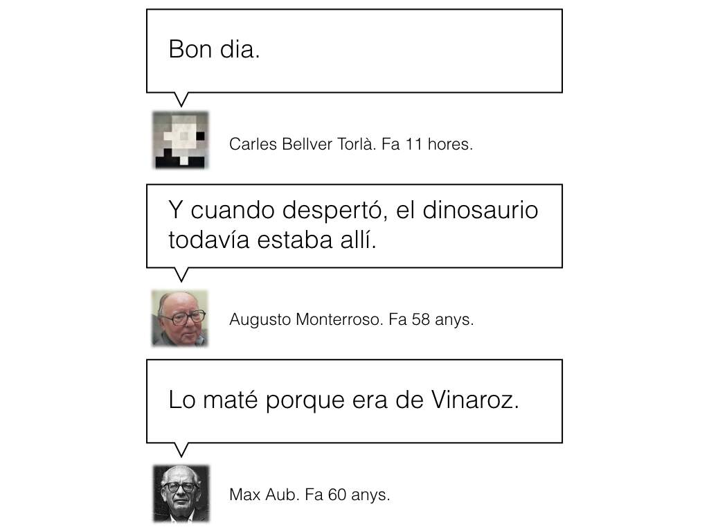</a>

Sigui com sigui, aquest potencial d’amplificació i aquesta pèrdua de context són encara més grans en les plataformes de xarxes socials a hores d’ara en voga. Jo vaig tardar a entrar en Facebook o en Twitter. Venia, com he dit, del món dels blogs, del web obert, i no veia gens clara la privatització que suposen aquestes plataformes. Cadascú pot crear el seu blog en Blogger, en Wordpress, en Tumblr, o en el seu web propi. En canvi, només pots tenir Facebook en el web de Facebook, adherint-te a les seves normes d’ús, empassant-te la publicitat que és el seu negoci i abandonant tota esperança pel que fa a la utilització de les teves dades personals. El mateix amb Twitter, si fa no fa. Aquestes consideracions van fer que em prengués les xarxes socials amb una certa distància i amb reticència. En algun moment vaig declarar el propòsit de no revelar mai res sobre mi en les xarxes socials. Vaig exagerar una mica. Al mateix temps, és clar, hi veia coses interessants i atractives. A Twitter vaig arribar el 2008. Sabeu que Twitter consisteix a publicar missatges breus, d’un màxim de 140 caràcters. Això és així perquè originalment es va pensar per a enviar els missatges per SMS, aquell sistema dels telèfons antics, abans del Whatsapp, i els SMS tenien un límit de caràcters. Però el que més em va cridar l’atenció és que allí la descontextualització era desconcertant. Amb aquella successió de missatges curts de diferents persones, no sabies ben bé de què parlava cadascú, a què estava fent referència, a què o a qui  contestava. Això, per a mi, creava un misteri, una suspensió del sentit que podia resultar gairebé poètica. Alguns tuits, per la seva ambigüitat, em feien pensar en aquell cèlebre microconte d’Augusto Monterroso: [“Y cuando despertó, el dinosaurio todavía estaba allí”](http://cvc.cervantes.es/actcult/monterroso/acerca/zavala.htm). O en alguns dels *Crímenes ejemplares* de Max Aub que eren més breus i tot: “Lo maté porque era de Vinaroz”, o “Que se declare en huelga ahora”. En aquests, com en molts tuits, el lector ha de completar el sentit.

## (10)

<a href="slide.010.jpg">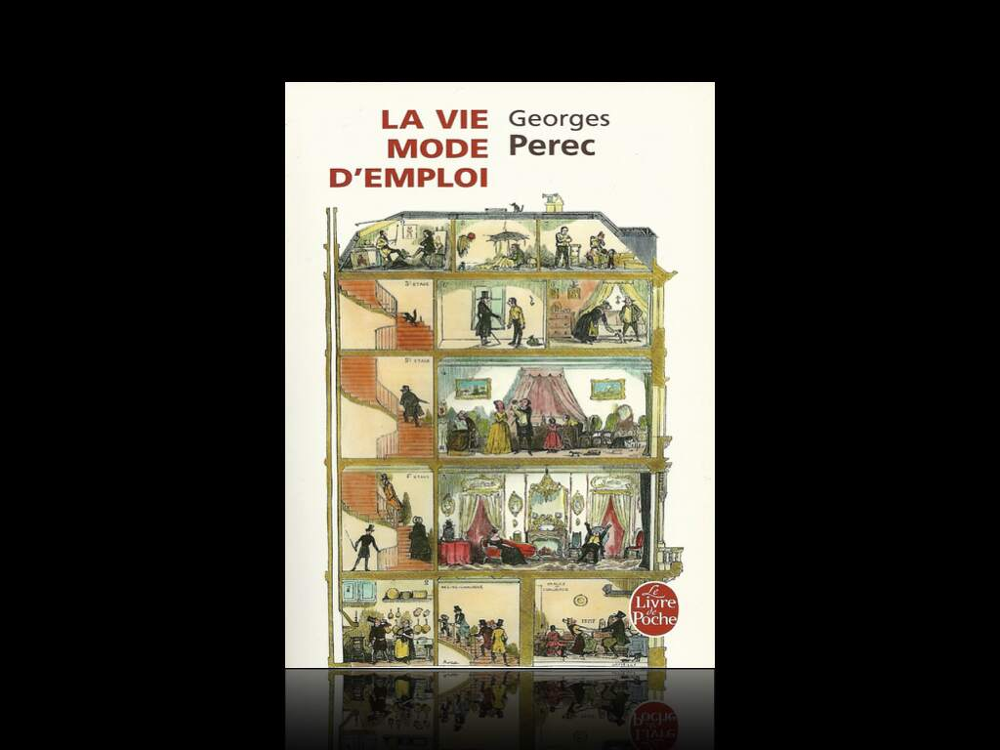</a>

Era inevitable, per tant, que se m’acudira utilitzar Twitter per a contar històries en 140 caràcters. O en seqüències de missatges de 140 caràcters. La idea em feia pensar en l’[Oulipo](http://cultura.elpais.com/cultura/2016/11/18/babelia/1479468446_792619.html), aquell “Taller de literatura potencial” fundat a París per Raymond Queneau, escriptor, i François Le Lionnais, matemàtic, i del qual també van formar part, entre altres, Italo Calvino o Georges Perec. Potser n’heu parlat en aquest taller. Sabeu que aquesta gent es proposaven crear obres utilitzant tècniques d’escriptura limitada. Escriptura amb constricció o trava. La constricció pot ser un element lingüístic o una estructura. Supose que els exemples més cèlebres són obres de Georges Perec. En la seva novel·la *La disparition* no utilitza ni una vegada la lletra e. En la traducció al castellà van decidir canviar-la per la a, ometre la a. Té mèrit, sens dubte. O *La vida instruccions d’ús*. Un llibre de culte centrat en un edifici de pisos de París. Cada un dels noranta-nou capítols descriu una cambra de l’edifici i explica la història o part de la història d’un personatge que viu en aquella cambra o es troba per algun motiu en aquella cambra. L’ordre en què van apareixent les cambres segueix els moviments del cavall en el joc d’escacs, d’una manera que fa que cada cambra només aparegui una vegada en el llibre. És a dir, una solució d’un famós problema d’escacs, el [problema de la ruta del cavall](https://ca.wikipedia.org/wiki/Problema_de_la_ruta_del_cavall). I encara té més complicacions, massa per a mi, com l’algoritme que segueix per a descriure els continguts de cada cambra.

## (11)

<a href="slide.011.jpg">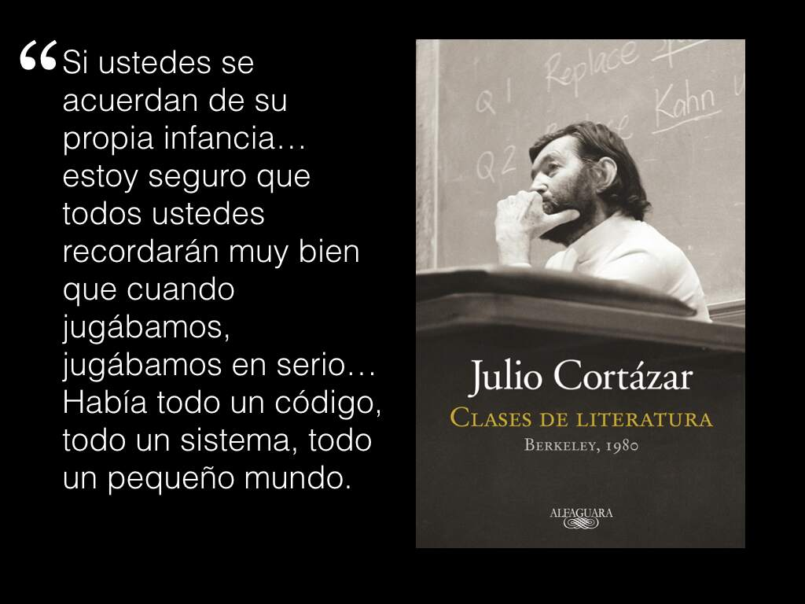</a>

He de dir que, a mi, aquest llibre de Georges Perec em va parèixer un exercici d’imaginació i de paciència. De part de l’autor i, pel que fa a la paciència, també de part del lector. Vaig trobar fascinant la trama d’històries dels cent seixanta-set personatges principals, però les descripcions em resultaven sovint tremendament avorrides. També he de dir que jo manque d’aquest esperit matemàtic, formalista. Almenys fins a aquest extrem. El meu temperament literari es decanta més cap al romanticisme i el surrealisme. La inspiració i l’escriptura automàtica. Sóc més amic d’André Breton que de Perec i companyia, per dir-ho d’una altra manera. Sempre he vist l’escriptura, la literatura, com un joc. I ja sé que un joc —Julio Cortázar ho remarcava, això— és una cosa molt seriosa. Té un codi, unes regles que creen un sistema, un petit món. Però diria que l’excés o l’abús de les regles pot matar el joc. I que els 140 caràcters eren la constricció, la trava més estricta que podia assumir. Em situava, per tant, més prop dels haikus que dels trencaclosques de Perec. Un haiku, ja ho sabeu, és una forma de poesia tradicional japonesa que consisteix en una composició breu de tres versos de cinc, set i cinc síl·labes. Un haiku, per tant, cap molt bé dins d’un tuit. I es practica molt, el [#haiku](http://twitter.com/hashtag/haiku), en Twitter, no penseu que no.

## (12)

Però no eren haikus el que jo vaig fer i us vull explicar ara. Un explique el projecte que se’m va acudir. Escriuria una història a base de tuits i la contaria en temps real en Twitter. Una història, doncs, en primera persona. De la qual no seria jo el protagonista. O no exactament. El narrador seria un personatge que ja havia aparegut en un dels meus llibres: un tal Charles Beauvoir, que és una mena d’alter ego literari meu. Beauvoir, que viu a Barcelona, vindria a Castelló per circumstàncies familiars i aniria explicant en directe en Twitter les coses que li passaven i les que li passaven pel cap. Per a fer-ho una miqueta més difícil, però només una miqueta —lúdic i seriós alhora, en el sentit cortazarià— vaig decidir que tots els tuits (excepte un) tindrien exactament cent quaranta caràcters. En aquell moment vaig llegir en algun lloc que, d’això, se’n deia un “tuit perfecte”. Una constricció com una altra. De manera que entre el divendres 6 de febrer de 2009 a les 18:18 de la vesprada i l’endemà, dissabte 7 de febrer, a les 18:02, vaig contar, o retransmetre, vint-i-quatre hores de la vida de Charles Beauvoir en una sèrie de tuits. No eren molts tuits, aproximadament un per hora.

## (13)

Això sí, com se suposava que ell patia insommni, de nit també havia de piular. Però jo no em volia passar la nit en blanc davant de la pantalla. Així que vaig escriure tots els tuits per endavant i vaig preparar un script —és l’avantatge d’haver treballat com a programador— que els enviaria cada un a una hora i minuts determinats. Aleshores vaig deixar que l’ordinador fera la seua feina i quan es va fer de nit em vaig gitar. També pot haver-hi certa bellesa, certa estètica, en l’escriptura de programes d’ordinador, però això seria un altre tema.

## (14)

Per a mi va ser una experiència satisfactòria. Vaig gaudir de tot aquell procés d’escriptura, programació, publicació… I em vaig sentir raonablement satisfet amb el resultat. Amb aquell petit conte de 3.424 caràcters. Que va tenir un cert ressò. Crec que vaig rebre una atenció excessiva d’algun mitjà online. No n’hi havia per a tant, evidentment, però supose que és normal que la novetat cridés l’atenció. Després vaig dibuixar unes il·lustracions, una per a cada tuit. I vaig publicar el relat complet en el meu web, sota el títol [“24 hores Ch. B”](https://carlesbellver.net/taller/24horesChB/), on encara es pot llegir. Aquesta era la intenció: evitar que s’esvaís en la cronologia de Twitter, tan volàtil. Que és un altre problema de les plataformes de xarxes socials: la impermanència. Són art efímer. Cada vegada que hi entres, la plataforma et mostra unes publicacions diferents. Això ho hem de tenir molt en compte. Si alguna cosa que creem en les xarxes socials val la pena i volem que romangui, l’hem de guardar o publicar en lloc segur. Twitter o Facebook no són lloc segur. No ens pertanyen i no hi tenim cap control.

(Al cap d’uns mesos, l’estiu següent, aquestes vint-i-quatre hores de Charles Beauvoir van tenir una continuació. Amb un amic escriptor que també tenia el seu alter ego literari propi, vam organitzar una conversa en Twitter entre tots dos. També es va poder seguir en directe i també la vam guardar, sota el títol [“Amb una mà davant i una altra darrere”](http://2mans.weebly.com).)

## (15)

<a href="slide.015.jpg">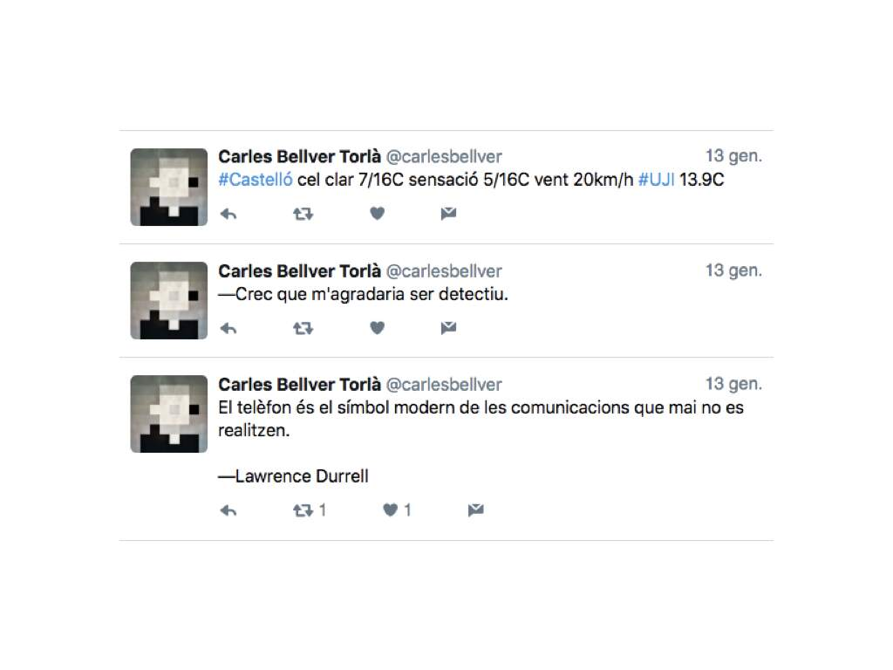</a>

No puc negar que, a mi, això d’utilitzar Twitter per a contar històries fictícies, m’havia agradat de debò. Més que contar la meva vida real, feliçment avorrida com la de tot bon funcionari i pare de família. I programar la publicació de tuits encara em va agradar més. L’any següent vaig donar una ocupació estable al meu script. El vaig convertir en això que anomenen un bot i ara piula els tuits per mi durant la nit. Li vaig dir [Wilbur](https://carlesbellver.net/2010/12/14/la-veu-de.html) i durant un temps va funcionar en el meu despertador, que és un miniordinador Linux. Em vaig inventar que era el guardià del meu son. La veu de la meva inconsciència. Envia a Twitter frases extretes dels meus contes, o idees que he apuntat per a futurs contes. De vegades són frases que ja no recorde haver escrit i ni jo mateix sé d’on ixen. Tot ix d’una base de dades on jo ho vaig introduint, és clar, però després ho selecciona aleatòriament l’script. També hi ha enllaços de notícies curioses o estranyes que m’he guardat, citacions d’altres autors, etc. Com si fossin fragments dels meus somnis. I cada matí, a les set en punt, té l’amabilitat de despertar-me amb el pronòstic meteorològic d’AEMET. De manera que jo, i tothom que em segueix en Twitter, podem saber quin oratge farà a Castelló. Avui, per exemple, ens ha avisat que tindríem mínima de 5ºC, màxima de 13ºC i que el termòmetre de l’estació meteorològica de l’UJI marcava 12,4ºC. No havia acabat d’arribar el fred siberià. Ara sí que està arribant.

Com podeu comprovar, m’he divertit bastant en Twitter. (Un darrer experiment narratiu que hi vaig fer: [100 % Charles Beauvoir](https://carlesbellver.net/taller/100x100chb/). Aquest va ser més senzill. Entre l’1 i el 20 de desembre de 2012, vaig enviar cent històries, cent microcontes, cada un autocontingut en els cent quaranta caràcters d’un tuit. Cent microcontes més un epíleg, un darrer tuit publicat l’endemà, 21 de desembre de 2012: “Troben erroni el còmput del calendari maia. La fi del món s’esdevingué dècades enrere. Des de llavors vivim en un no-futur postapocalíptic.” Recordem que aquell dia era quan s’havia d’acabar el món.)

## (16)

<a href="slide.016.jpg">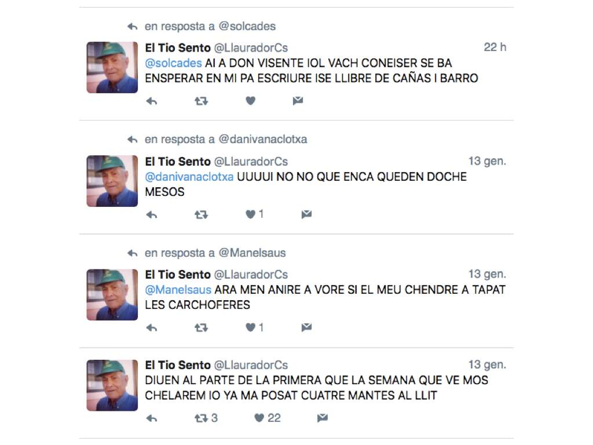</a>

Però no voldria que semblés que em poso com a exemple únic. En realitat jo tan sols he desenvolupat aquestes experiències puntuals que us acabe d’explicar i poc més. Conec altres comptes de Twitter que són una obra d’art continuada en si mateixos, que cada tuit que envien és una delícia llegir-lo. Comptes d’escriptors, com ara el nostre poeta [Josep Porcar](https://twitter.com/llambreig), o el [fals William Gibson](https://twitter.com/AuthenticWmGibs) que emulava en 140 caràcters arguments dignes de l’autèntic William Gibson, el famós escriptor nord-americà de ciència-ficció. Però reconec que la meva debilitat són els comptes de personatges ficticis, com [@NOSTRESINYO](https://twitter.com/NOSTRESINYO), que amb l’avatar del Pantocràtor de Sant Climent de Taüll fa els tuits en català antic com si ens parlés el Déu Pare medieval en persona. O el [Tio Sento](https://twitter.com/LlauradorCs), que escriu tal com sona en un peculiar valencià castellonenc de llaurador. Literatura humorística del segle XXI arrelada en la tradició.

## (17)

<a href="slide.017.jpg">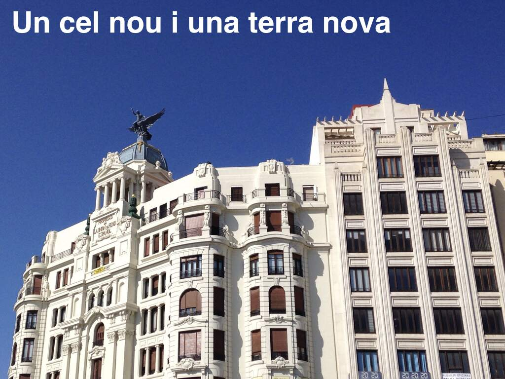</a>

També m’he divertit en Facebook, però d’una altra manera. Fa tres anys, el 2014, vaig pensar que l’utilitzaria per compartir un conte que tenia embastat, pràcticament enllestit, i recolliria així l’opinió dels meus lectors. Això ja ho havia fet en alguna altra ocasió en el meu blog i vaig seguir el mateix mètode: publicar cada dia un fragment, una secció del relat. En Facebook va tenir més ressó, més lectures i més comentaris. Perquè en Facebook és on hi ha a hores d’ara més gent. Ara quasi ningú es recorda dels blogs. I amb cada “M’agrada” o cada comentari augmenta la difusió. Ho veu més gent. Aquesta vegada es tractava d’“Un cel nou i una terra nova”, el relat que després donaria títol al llibre del premi Josep Pascual Tirado. Arran de la publicació en Facebook i dels comentaris que vaig rebre, vaig introduir-hi alguns canvis. Em va servir per detectar algun punt fluix, algun punt que s’entenia pitjor que la resta.

## (18)

I després, quan vaig decidir presentar aquest relat al premi, el vaig esborrar de Facebook. Per què? Perquè el punt u de les bases del premi deia que “les obres participants… hauran de ser originals, *inèdites…*” Qui sap si una obra publicada a trossos en Facebook, o en un blog, etc., compta com a inèdita? Jo no ho sé i per tant el vaig esborrar. No em volia arriscar. Que ningú no digués: això està publicat en Internet. Ara que vagin i que ho busquin. Jo ho negaré tot. Les bases dels premis, en general, solen estar una mica antiquades. Per exemple quan exigeixen tantes còpies impreses i enquadernades. O això de posar un límit de pàgines sense tenir en compte el tipus de lletra, o l’interlineat, etc. En lloc d’utilitzar el nombre de caràcters que és una mesura objectiva que està en tots els processadors de textos. Però a l’hora d’escriure continuem ancorats mentalment en el paper, en la pàgina impresa i en la màquina d’escriure. Ací tenim un altre tema del qual m’encantaria parlar un altre dia.

## (19)

<a href="slide.019.jpg">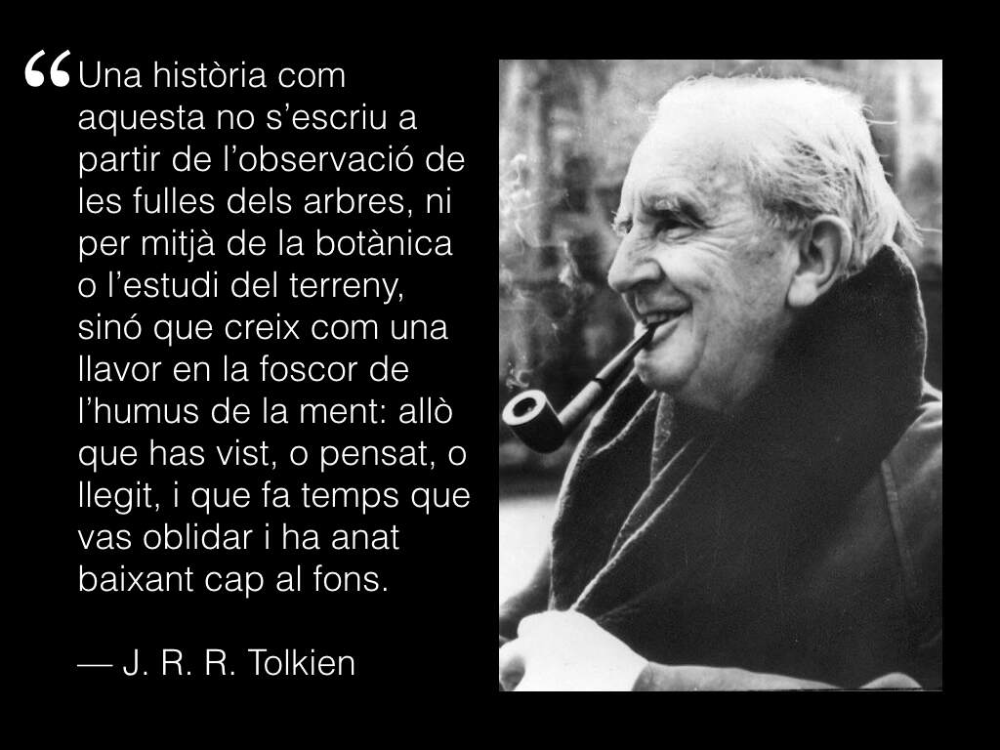</a>

Avui toca parlar del que toca parlar. I “Un cel nou i una terra nova” és un exemple d’una qüestió interessant que he esmentat abans. Com funciona el procés d’escriptura? D’on em venen les idees, per a començar. Poden venir d’una lectura, d’un llibre, d’una notícia, d’una cosa que vas veure o vas escoltar al carrer i que recordes, o que vas oblidar i ara retorna. Allò que Tolkien anomenava l’humus de la ment. D’un somni, també. En el cas d’aquest relat, una nit vaig somniar aproximadament la primera pàgina. L’endemà de matí en vaig esbossar la continuació, sense parar fins al final de la primera part. Va ser una mena de continuació del somni. Com si somniara despert. El subconscient, l’humus de la ment, anava alimentant el relat, em dictava els fets i em presentava els escenaris. L’estranya història d’amor, el simbolisme de l’acte sexual i de la maternitat, aquesta ciutat degradada que és València però no és València, la vessant de crítica social, amb els homes de negre que controlen els comptes públics, el rerefons de corrupció i d’enriquiment, la repressió, etc. Tot això no van ser decisions conscients meves. Simplement el relat se m’anava acudint així. Jo no he sabut mai escriure un relat amb un missatge preconcebut. Quan he volgut escriure una història de denúncia, contra la guerra, per exemple, o contra el mal govern, o tan sols cenyir-me a un tema determinat, m’ha eixit sempre un text sense força, sense autenticitat. Per això ja fa temps que vaig renunciar a intentar-ho i confie només, com he dit abans, en la inspiració, en l’escriptura automàtica. Això vaig fer amb aquest relat. En un matí, com he dit, fins al final de la primera part. I allà em vaig quedar encallat. La solució va consistir a deixar-lo reposar. Vaig deixar passar dies, setmanes, i per fi se’m va acudir el final. Va tornar la inspiració.

## (20)

Mentrestant em vaig dedicar a revisar, reescriure, polir tot el que tenia escrit. Perquè aquesta és la segona fase. Si només exalçava les virtuts de l’escriptura automàtica estaria dient una veritat a mitges. La meitat de la veritat. L’altra meitat és revisar, revisar i revisar. I llençar esborranys a la parerera, o arxivar-los. Cada un dels meus contes ha estat revisat moltes vegades. I per cada un que he publicat n’hi ha dos que no es publicaran mai. “Un cel nou i una terra nova” va passar catorze revisions completes abans d’enviar-lo al premi. Vaig afegir coses, en vaig llevar, vaig reescriure cada paràgraf, gairebé cada frase. I al final, en les galerades i en el llibre imprès, encara hi trobe errades, coses que no m’agraden. Supose que és inevitable. Encara retocaria frases i canviaria algunes paraules.

## (21)

Després podem parlar més d’”Un cel nou i una terra nova”, si voleu. La segona part del llibre, ja ho deveu haver vist, no té cap relació amb aquest primer relat més extens. Es titula “Set somnis d’escriptors i un d’una escriptora” i són vuit relats breus, molt breus, que només pretenen evocar els mons de set escriptors i una escriptora. Que siguen molt breus no vol dir que mereixin menys consideració, al meu parer. Unes històries exigeixen major extensió i altres es resolen de manera més efectiva en tres o quatre pàgines. De fet, ací hi ha probablement dues o tres de les peces que més m’estime de totes les que he escrit en aquests vint i tants anys d’escriptor. No us diré quines són perquè això importa poc, quines m’agraden a mi. La qüestió és que agraden a qui les llegeix, si és que han d’agradar a algú.

Per què vaig afegir aquesta segona part? En el llibre vaig incloure una nota una en què intentava enllaçar ambdues parts mitjançant la idea dels somnis. Però en el fons la qüestió era molt més simple: calia arribar com a mínim a les setanta-cinc pàgines A4. “No és el mateix escriure que fer un llibre”, [com va dir Eduardo Mendoza](https://twitter.com/tonipunti/status/804060690675859460) fa poc, en ocasió de guanyar el premi Cervantes. Aquest és un problema amb el qual convivim els escriptors i particularment els de narrativa breu. Si volem publicar en el mercat editorial realment existent, hem d’agrupar els contes en un llibre i ajustar-nos al format estàndard, a l’extensió estàndard d’un llibre. No acabe d’entendre del tot per què un poemari pot contenir molt menys material que un llibre de contes, però la vida és així.

## (22)

La solució més comuna és simplement ajuntar tots els contes que tens inèdits, que poden ser totalment heterogenis, de moments diferents i d’estils diferents. Però de vegades té més gràcia buscar-los algun fil conductor, crear algun tipus d’estructura que els emmarque i els done un sentit de conjunt. En *La vida canina* em vaig inventar —ho explicava en el pròleg— que els relats havien estat escrits originalment per pacients d’un gabinet psiquiàtric i que jo m’havia limitat a reescriure’ls, a donar-los una forma literària més acabada. En *L’home del calendari* vaig simular que es tractava d’un diari, un dietari, escrit pel meu alter ego Charles Beauvoir durant la seva estada en una república imaginària d’Europa Central. I *La nit mil dos*, el vaig plantejar com la narració en temps real d’una nit d’insomni del mateix Charles Beauvoir. Des de les dotze de la nit, aproximadament, fins a les set del matí, quan sonava el despertador, s’anava contant a ell mateix una sèrie de contes, a veure si així s’adormia. En lloc de comptar ovelles. Una mica com el sultà de les mil i una nits, però sense Xahrazad. Se’ls contava ell mateix.

Crec que és més divertit així i és també part del joc de la creació literària. A posteriori m’adone que no sé si se m’hauria acudit això de simular un diari i narrar una falsa nit d’insomni si no hagués tingut primer l’experiència d’un blog i del Twitter. No dic que fossin idees noves perquè no ho són. Són coses que ja s’havien fet mil vegades en la literatura moderna. Només dic que no sé si *jo* hauria tingut aquestes idees o m’haurien engrescat. Els canvis tecnològics també influeixen en la manera com ens plantegem l’escriptura. El cine, per exemple, va influir molt en la manera de contar històries i és normal que Internet també ho faci.

## (23)

En resum, per a acabar:

  - Escriure contes, i l’escriptura creativa en general, és una activitat apassionant.
  - La Internet, les xarxes socials, no només serveixen per a informar-se, per a comunicar-se i per a xafardejar — unes altres activitats que no menysprearem— sinó que també són una magnífica excusa per a estimular la creativitat.
  - Ha estat un plaer explicar-vos les meves dèries. Espere no haver-vos avorrit molt, gràcies per l’amabilitat d’escoltar-me, i si voleu que continuem xarrant ací em teniu.

## (24)

