+++
title = "Dos-cents anys d’Edgar Allan Poe"
description = "Imatges de la presentació i notes per a l’acte d’homenatge de la SCCFF a Edgar Allan Poe. Castelló de la Plana, Llotja del Cànem, 19 de gener de 2009."
image = "Poe-01.jpg"
+++

Imatges de la presentació i notes per a l’acte d’[homenatge de la SCCFF a Edgar Allan Poe](http://essaefa.blogspot.com/2009/01/homenatge-de-la-sccff-poe.html). Castelló de la Plana, Llotja del Cànem, 19 de gener de 2009.

## (1)

<a href="Poe-01.jpg">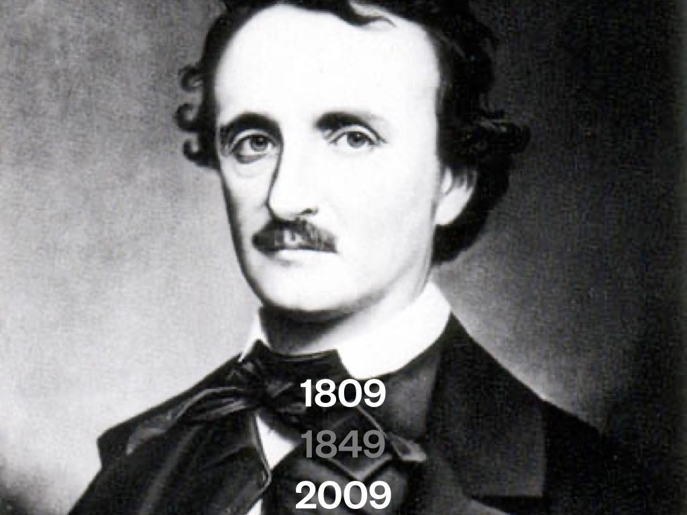</a>

- No sé si cal justificar l’homenatge a Poe…
- Potser ell pensaria que sí, perquè dos-cents anys els té qualsevol. Però només Edgar Allan Poe és Edgar Allan Poe.
- Sigui com vulgui, el fet que ens recordem avui d’ell i que siguem ací aquest grup de gent, dos-cents anys després, crec que és prou justificació.

## (2)

<a href="Poe-02.jpg">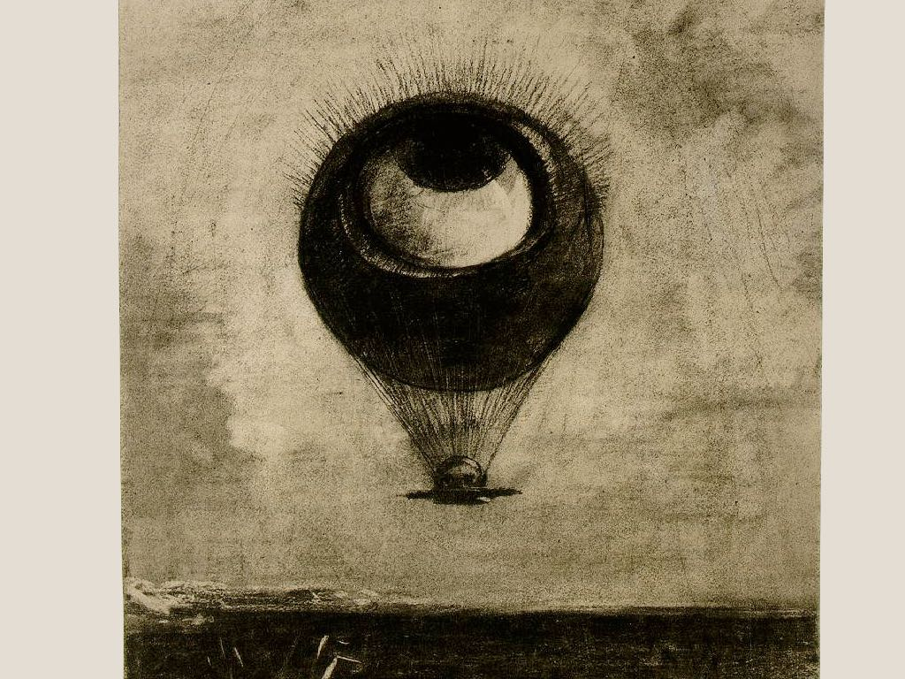</a>

- Per a començar, atès que ens convoca la [SCCFF](http://www.sccff.cat/), recordem Poe com un dels precursors de la ciència-ficció.
- Viatges en globus per l’espai i en el temps: “*The Unparalleled Adventure of One Hans Pfaall*” o “*Mellonta Tauta*”.
- Inspiració per a Verne: *Cinc setmanes en globus*.
- La imatge: una litografia d’[Odilon Redon](https://en.wikipedia.org/wiki/Odilon_Redon), d’una sèrie que va dedicar a Poe (1882).
- També: [“The Balloon-Hoax”](https://en.wikipedia.org/wiki/The_Balloon-Hoax).
- Habilitat per a les mistificacions, per a conferir credibilitat als seus escrits. Ficcions presentades com a cròniques o reportatges.

## (3)

<a href="Poe-03.jpg">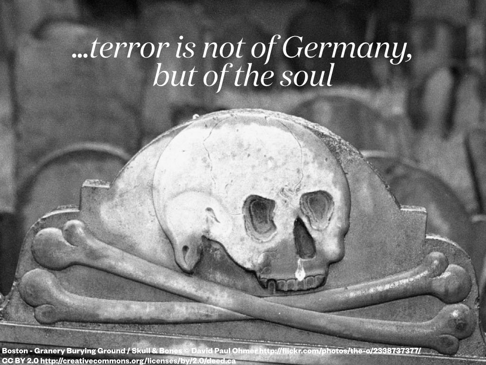</a> <a href="http://www.flickr.com/photos/the-o/2338737377/">flickr.com/photos/the-o/2338737377</a>

- Poe, doncs, no és sols terror. No és sols aquell conjunt de relats macabres pels quals és sovint conegut: “Berenice”, “El gat negre”, “La caiguda de la casa Usher”, “El cas del senyor Valdemar”, etc., etc.
- (Que no són, d’altra banda, els meus preferits.)
- Poe té moltes cares. Relats de terror molt més subtils, més psicològics, com “El pou i el pèndol”, o “El cor delator”.

## (4)

<a href="Poe-04.jpg">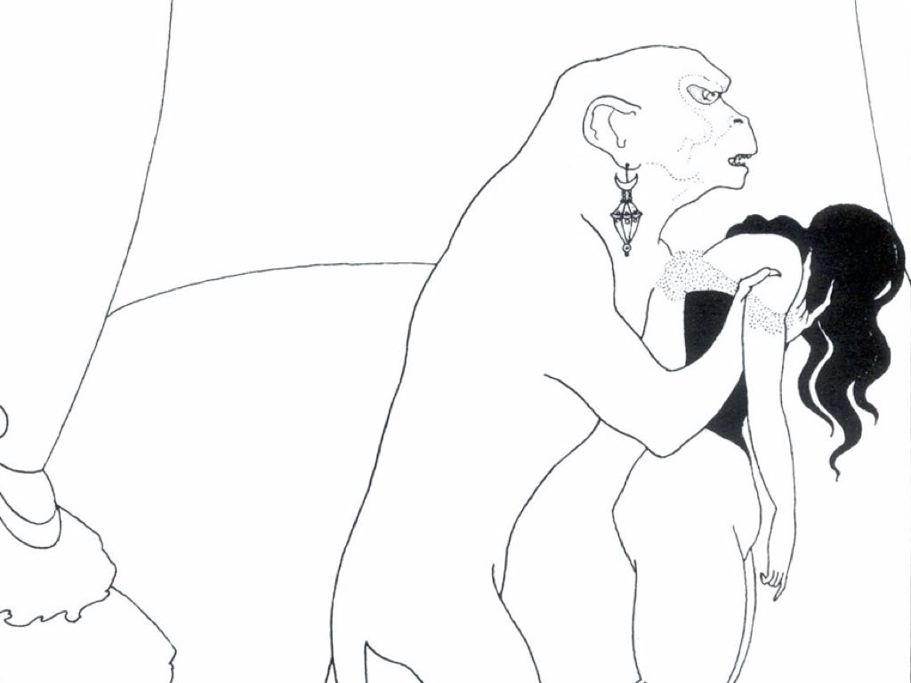</a>

- El primer relat detectivesc modern: [“Els crims de la Rue Morgue”](https://en.wikipedia.org/wiki/The_Murders_in_the_Rue_Morgue) (1841).
- El primer detectiu literari: [C. Auguste Dupin](https://en.wikipedia.org/wiki/C._Auguste_Dupin).
- Dupin també actua en “El misteri de Marie Rogêt” o en “La carta robada”.
- Un model imitat: capacitat de deducció brillant, imaginació creativa, resolució sorprenent que s’explica pas a pas a continuació, narrador amic del protagonista…

## (5)

<a href="Poe-05.jpg">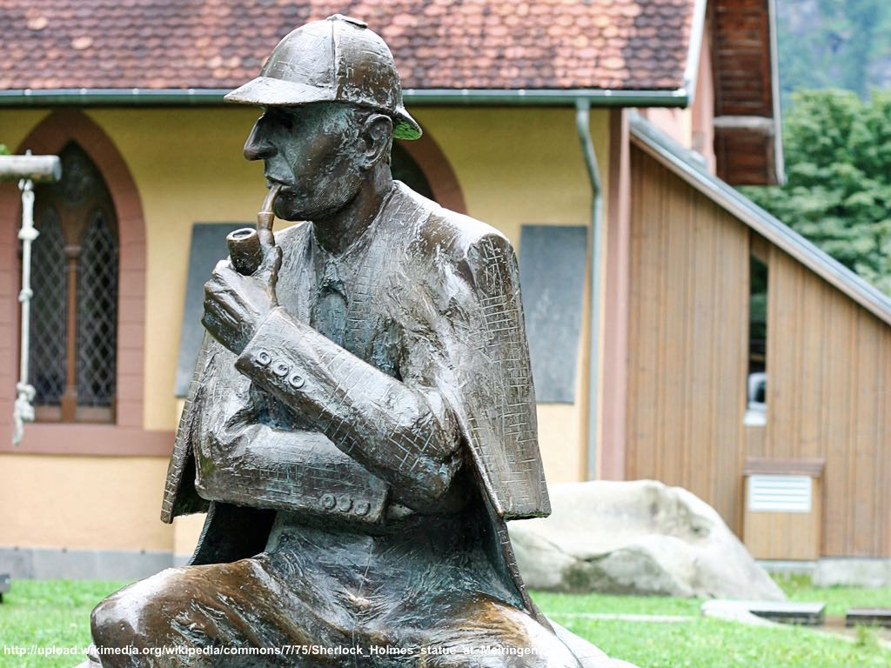</a> <a href="http://commons.wikimedia.org/wiki/File:Sherlock_Holmes_statue_at_Meiringen2.jpg">Statue of Sherlock Holmes at Meiringen, Switzerland</a>

- Dupin és el pare de Sherlock Holmes.

## (6/7)

<a href="Poe-06.jpg">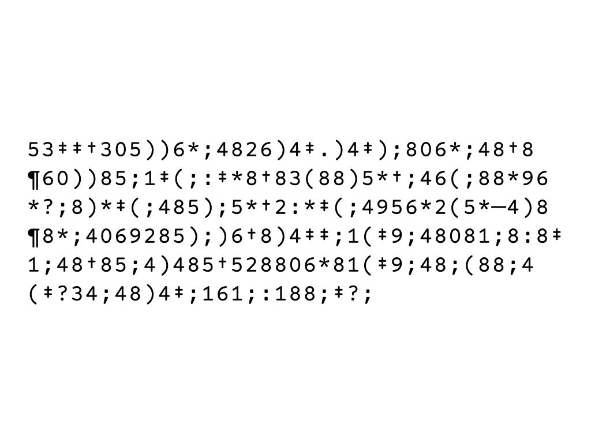</a>

<a href="Poe-07.jpg">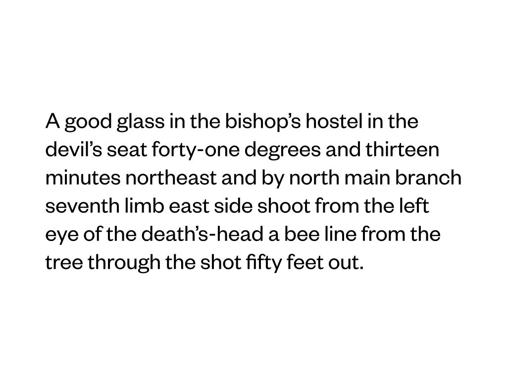</a>

- Un altre conte cèlebre: [“L’escarabat d’or”](https://en.wikipedia.org/wiki/The_Gold-Bug).
- Un altre element característic, brillant: la criptografia. La cerca del tresor i el missatge per desxifrar.

## (8)

<a href="Poe-08.jpg">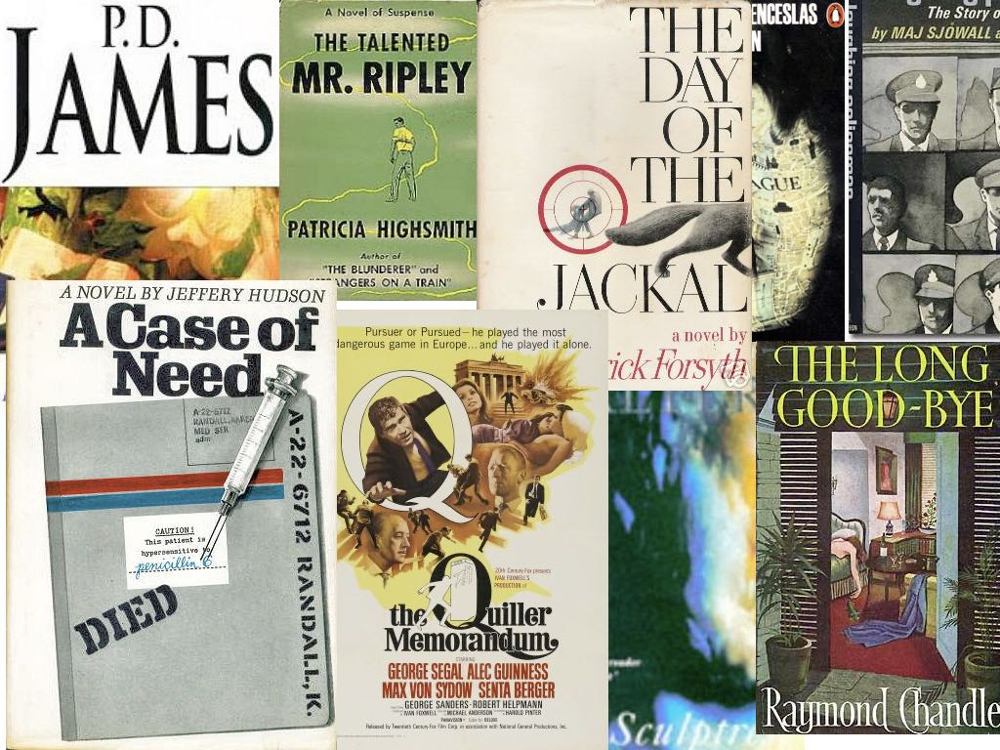</a>

- Poe és el fundador de la novel·lística detectivesca, com va reconèixer el mateix Conan Doyle.
- Així ho reconeixen els [Edgar Awards](https://en.wikipedia.org/wiki/Edgar_Award).

## (9)

<a href="Poe-09.jpg">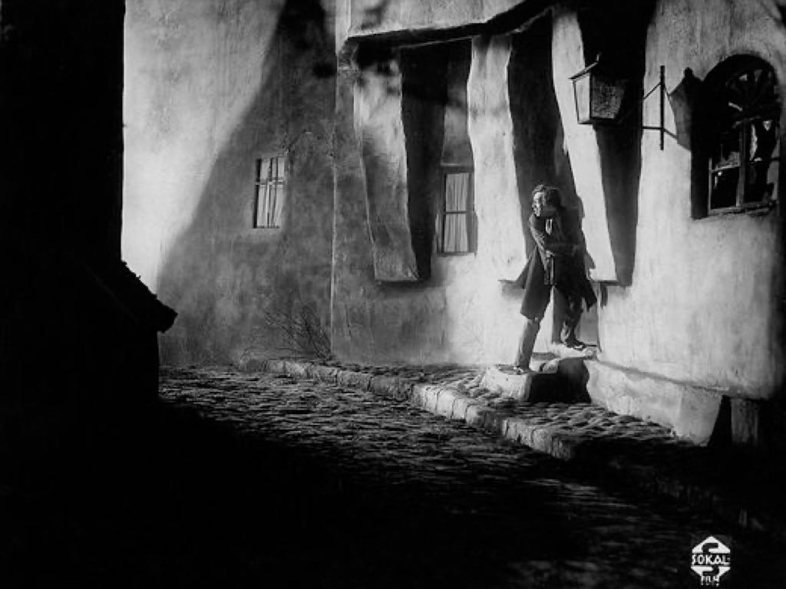</a> Fotograma de la pel·lícula [*L’estudiant de Praga*](https://en.wikipedia.org/wiki/The_Student_of_Prague_%281913_film%29), adaptació lliure de “William Wilson”

- I encara n’hi ha més. Té relats, podríem dir-ne, indefinibles.
- [“William Wilson”](https://en.wikipedia.org/wiki/William_Wilson_%28short_story%29): el tema del doble (*doppelgänger*).

## (10)

<a href="Poe-10.jpg">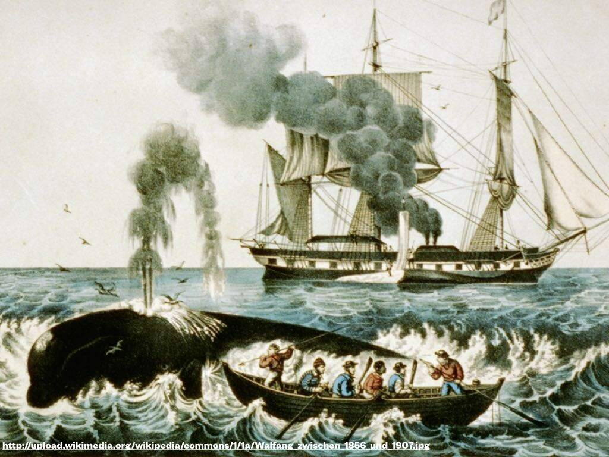</a> <a href="http://commons.wikimedia.org/wiki/File:Walfang_zwischen_1856_und_1907.jpg">Pesca de la balena</a>

- El seu primer conte: [“El manuscrit trobat en una botella”](https://en.wikipedia.org/wiki/MS._Found_in_a_Bottle).
- Premiat: va marcar el seu pas a la narrativa.
- L’ambient marítim.

## (11)

<a href="Poe-11.jpg">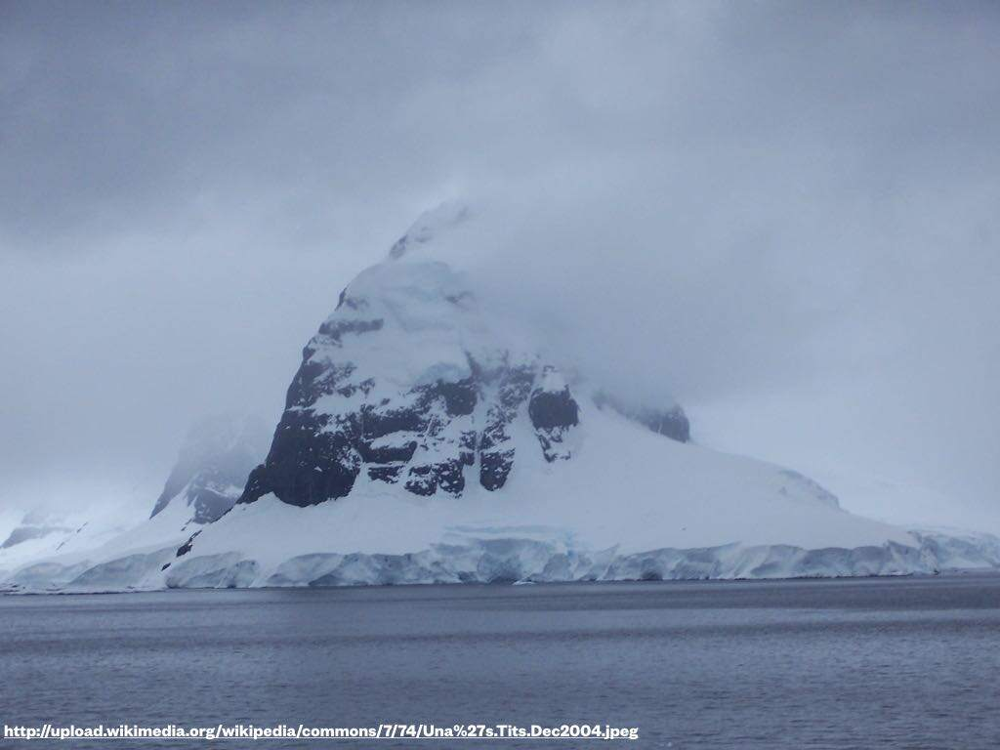</a> [http://commons.wikimedia.org/wiki/File:Una%27s.Tits.Dec2004.jpeg](http://commons.wikimedia.org/wiki/File:Una%27s.Tits.Dec2004.jpeg)

- [*La narració d’Arthur Gordon Pym of Nantucket*](https://en.wikipedia.org/wiki/The_Narrative_of_Arthur_Gordon_Pym_of_Nantucket)
- Novel·la publicada per entregues com a narració verídica (una altra falsificació!).
- Inspiració per a Verne: *L’esfinx dels gels*.
- També per a Lovecraft: *A les muntanyes de la follia*.

## (12)

<a href="Poe-12.jpg">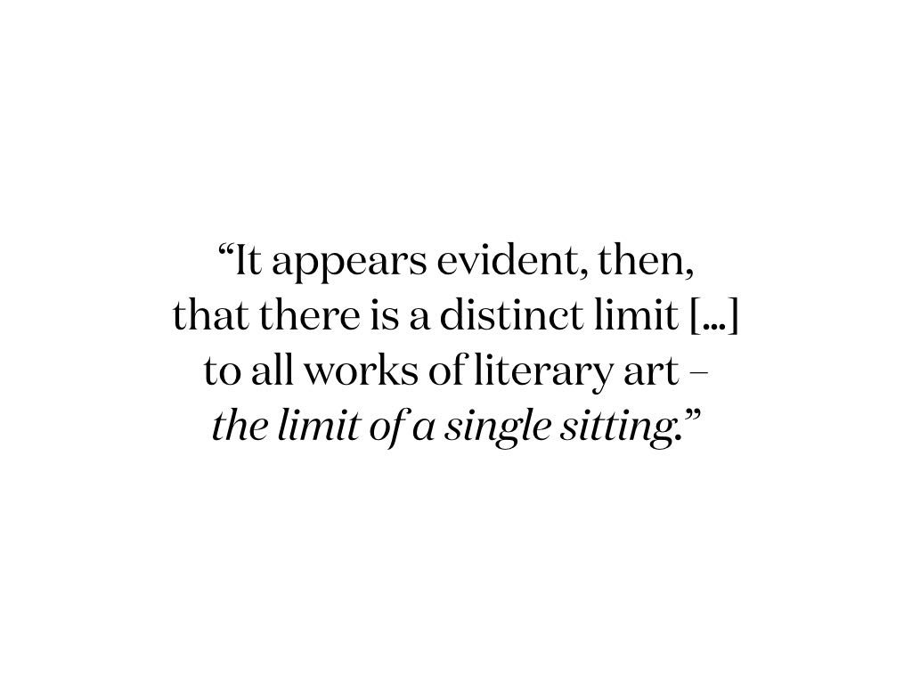</a>

- Seixanta i tants contes. Només una novel·la.
- Avui és considerat un dels precursors del relat breu modern.
- Això ara, perquè en el seu moment…

## (13)

 <a href="http://flickr.com/photos/neubie/2273635564/">flickr.com/photos/neubie/2273635564/</a>

- Va ser un dels primers autors moderns que va intentar viure del seu treball com a escriptor. I no ho va aconseguir.
- Nosaltres ja no ho hem intentat.

## (14)

<a href="Poe-14.jpg">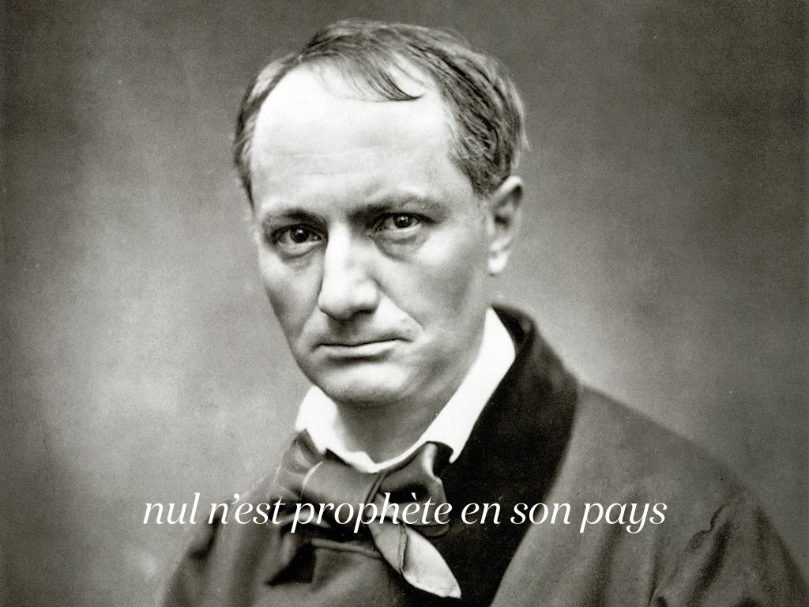</a>

- Reconegut abans a França que a casa seva: però això sol ser bon senyal.
- Baudelaire el tradueix. Mallarmé.
- Influència en la poesia simbolista, en els poemes en prosa… tant els seus temes com la seva poètica.

## (15)

<a href="Poe-15.jpg">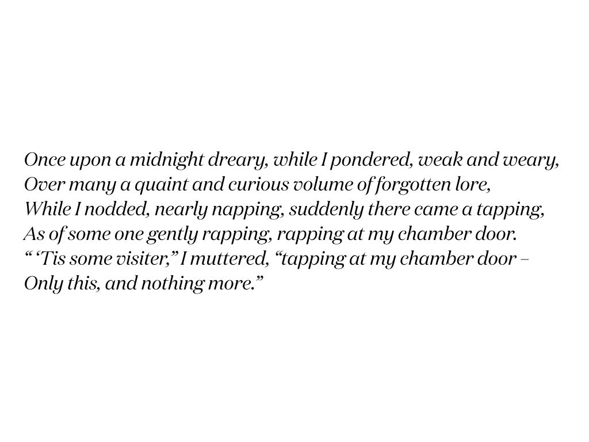</a>

- Més conegut en algun moment com a crític.
- [*The Philosophy of Composition*](https://en.wikipedia.org/wiki/The_Philosophy_of_Composition): aplicable a la poesia i a la prosa breu
- Utilitza com a exemple el seu poema "El corb".
- "The limit of one sitting": la resposta emocional o efecte que es pretén causar en el lector, s’aconsegueix millor en obres que es poden llegir seguides.
- La unitat d’efecte.

## (16)

<a href="Poe-16.jpg">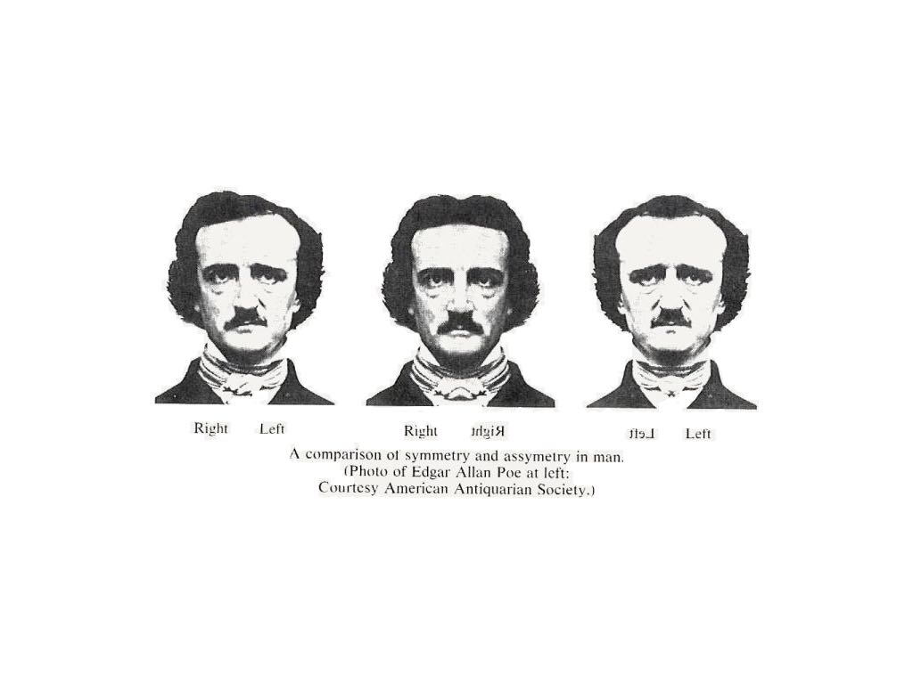</a>

- Gràcies, doncs, a Poe per haver escrit tant i tan creativament. Poemes i relats que es llegeixen tan bé i que van ser alhora tan innovadors, que van obrir nous camins.
- Un equilibri molt difícil!
- Agraïts com a lectors i com a escriptors per haver perseverat contra vent i marea.
- Per sort tenim accessible la seva obra:
  - En català: traducció de Joan Solé, Columna, 2002.
  - En castellà: la traducció de Julio Cortázar dels contes complets, en Alianza Editorial.
- I lliure de drets! Si us animeu a llegir-lo en anglès, podeu aprofitar que tota la seva obra fonamental està disponible gratis en Internet.
